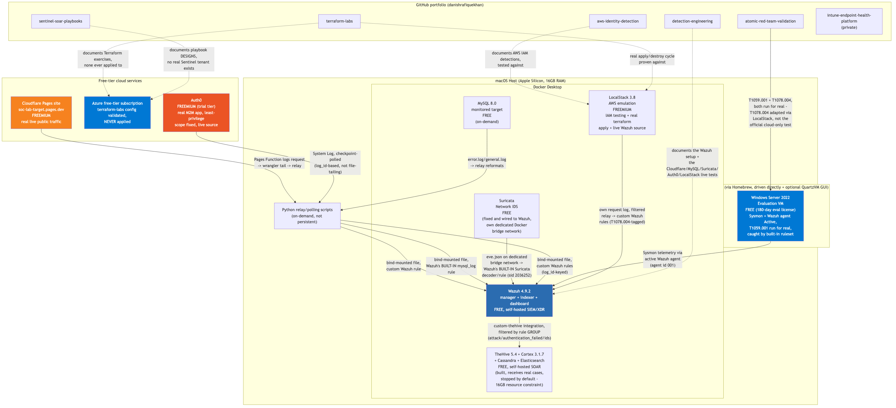

**Part 1: Lab Architecture Overview**<!--h1-->

**What this lab actually is**<!--h2-->

A single MacBook (Apple Silicon, 16GB RAM) running a mix of self-hosted, containerized open-source security tools alongside a small number of free-tier cloud services, plus a public GitHub portfolio documenting the detection engineering, cloud security, and identity security work built on top of it. Nothing in this lab costs money to run in its current state — that was a deliberate constraint, not an accident, because the goal was to build genuine, defensible hands-on experience without needing an employer's budget or a training course's pre-built environment.

The lab is not one finished system. It is several independently useful pieces, some fully wired together and proven end-to-end with real traffic and real alerts, some built but not yet connected to anything else, and some still open questions. This document is honest about which is which — see the diagram below, and the "what's actually connected vs not yet" section immediately after it.

**Master architecture diagram**<!--h2-->

Solid arrows are real, verified, currently-working data flows. Dashed arrows are either genuinely absent connections (documented gaps) or "this repo documents/tests against this thing, but there's no live data flow" relationships. Reading the dashed arrows honestly is as important as reading the solid ones — a lab diagram that only shows solid arrows is lying by omission.

**What's actually connected vs not yet (read this before anything else)**<!--h2-->

**Actually working, verified with real traffic, right now:**

- Cloudflare Pages site → Python relay → Wazuh (custom rule, fires on `/login.html` hits)
- MySQL container → Python relay → Wazuh (built-in `mysql_log` rule, fires on failed auth)
- Suricata → Wazuh, over a dedicated Docker bridge network → Wazuh's built-in Suricata decoder/rule (real ET ruleset alert, "ET SCAN RDP Connection Attempt from Nmap" sid 2036252, fired via rule id 86601 — no custom rule needed, same situation as MySQL)
- Auth0 System Log → checkpoint-polling script → Wazuh custom rules (a fourth live source, with a real least-privilege lesson along the way — see the first architectural decision below)
- LocalStack's own request log → filtered relay → Wazuh custom rules (a fifth live source — real IAM `CreateUser`/`AttachUserPolicy`/`CreateAccessKey` calls, tagged MITRE T1078.004, built specifically because the official Atomic Red Team tests for that technique all need real Azure/GCP cloud resource creation with no benign local variant)
- A real Cowrie SSH honeypot → its own JSON log → Wazuh custom rules (a sixth live source, and a different kind from the other five — it doesn't relay real legitimate traffic that happens to see attack noise, it exists purely to be attacked. Currently bound to `127.0.0.1` only, so every real alert it's produced so far is self-generated test traffic, not genuine unsolicited internet attacks — exposing it to the real internet is a separate, not-yet-made decision)
- A loopback-only live status dashboard (`local-lab/dashboard/`) — a small stdlib-only Python page showing which of the six sources above have alerted recently and a real-time feed as new alerts land, reading Wazuh's own `alerts.json` via `docker exec tail -F` since that file lives in a named Docker volume, not a host bind mount
- Wazuh → custom `custom-thehive` integration → TheHive cases (verified across three live sources: Cloudflare, MySQL, Suricata, with real case numbers; routine platform noise correctly did not create cases)
- The Windows Server VM — Sysmon installed (SwiftOnSecurity config) and the Wazuh agent installed, enrolled, and confirmed **Active** on the manager. Both of `atomic-red-team-validation`'s case studies have now been run for real: T1059.001 (encoded PowerShell), caught clean by Wazuh's **built-in** Sysmon ruleset with correct dual MITRE mapping (T1047 WMI + T1059.001 PowerShell); and T1078.004 (Cloud Accounts), adapted via the LocalStack source above since the official test needs real cloud login. A real gap found along the way: Wazuh's Windows agent doesn't monitor the Sysmon event channel by default, so that had to be added explicitly before any Sysmon telemetry could ever arrive.
- `terraform apply`/`destroy`, for real — but against LocalStack (free, local AWS emulation), not the real Azure subscription every other exercise here targets. LocalStack only emulates AWS, so this is a deliberately separate exercise using the `aws` provider, not a retroactive application of the existing `azurerm`-based ones. A real bug got hit and fixed along the way (S3 path-style addressing) — see Part 10.

**Built and working, but not always running:**

- TheHive + Cortex — a real case management/SOAR stack that now actually receives cases from Wazuh alerts (see above), but sits **stopped by default** — a real Docker resource constraint on a 16GB Mac, only brought up when actually needed, not a "built but disconnected" gap anymore.
- LocalStack — used for AWS IAM testing content (`aws-identity-detection`), a real terraform apply/destroy cycle, and now a live Wazuh source (see above) — genuinely the most reused single piece of free infrastructure in this whole lab.

**Documented as a plan, never actually built:**

- Any `terraform apply` against the real **Azure** subscription specifically — every `azurerm`-based exercise in terraform-labs is syntax-valid and `terraform validate`-clean, and none has ever created a single real Azure resource. (A real apply/destroy cycle now exists, just against LocalStack/AWS instead — see above.)

**Why the lab is structured this way**<!--h2-->

Three deliberate architectural decisions run through everything else in this document, and understanding them up front makes every later section make more sense:

**1. Wazuh, not Sentinel, is the live SIEM — and the Sigma/KQL detection content stays written for Sentinel anyway.** Sentinel costs real money to run meaningfully; Wazuh is free and self-hosted. But Wazuh's architecture (agents + manager, built for host and network telemetry) is a genuinely poor fit for cloud identity provider log schemas like Entra ID sign-in logs — forcing that content onto Wazuh just to claim "it runs somewhere" would be a fake fit, not a real one. So the detection content that's meant to demonstrate Sentinel/KQL skill stays written for Sentinel's schema, syntax-validated but never fired against real Sentinel data (no free real Sentinel tenant exists yet — the Microsoft 365 Developer Program's E5 trial is the actual next step, not something blocked by cost). Meanwhile Wazuh gets its own, separate detection content — the Cloudflare, MySQL, Suricata, Auth0, and now LocalStack rules — written specifically for what Wazuh actually is. Auth0 working via Wazuh custom rules doesn't contradict this reasoning, it confirms it: Auth0's System Log exposes a plain pollable REST API, the same shape as Cloudflare's request logs, so wiring it into Wazuh with a checkpoint-polling script and custom rules is a normal custom-rule integration, not a fake fit. Entra ID is different — its real ingestion path is Sentinel's own analytics rules against `SigninLogs`/`AuditLogs`, a fundamentally different mechanism with no plain pollable log endpoint underneath it — so faking that native pipeline on top of Wazuh would still be exactly the fake fit this decision argues against, which is why Entra ID content stays written for Sentinel. Part 5 covers this "platform translation problem" in full depth, because it's one of the most transferable lessons in the whole lab.

**2. Everything that touches real traffic is disclosed as synthetic, and audited for real-data leaks before going public.** The Cloudflare site has an on-page banner disclosing it's a lab fixture. Every IP in every committed sample uses documentation-reserved ranges. A full confidentiality audit (current files and entire git history, across every repo) was run before treating any of this as safe to be public, and it found and fixed one real leak — a specific former employer's tool name, genericized before that repo could go public. This isn't paranoia; it's a real discipline anyone building a public portfolio from real work experience needs, and it's worth doing deliberately rather than trusting that nothing slipped through.

**3. Gaps stay visible instead of getting quietly built around.** TheHive/Cortex sitting stopped by default, no `azurerm` terraform ever being applied, no Atomic Red Team run against the Windows VM yet even though it's finally ready for one — none of these get hidden by only documenting the parts that work. A lab that shows you the finished, polished 20% teaches you a fraction of what one that shows the real, still-in-progress 100% does.
