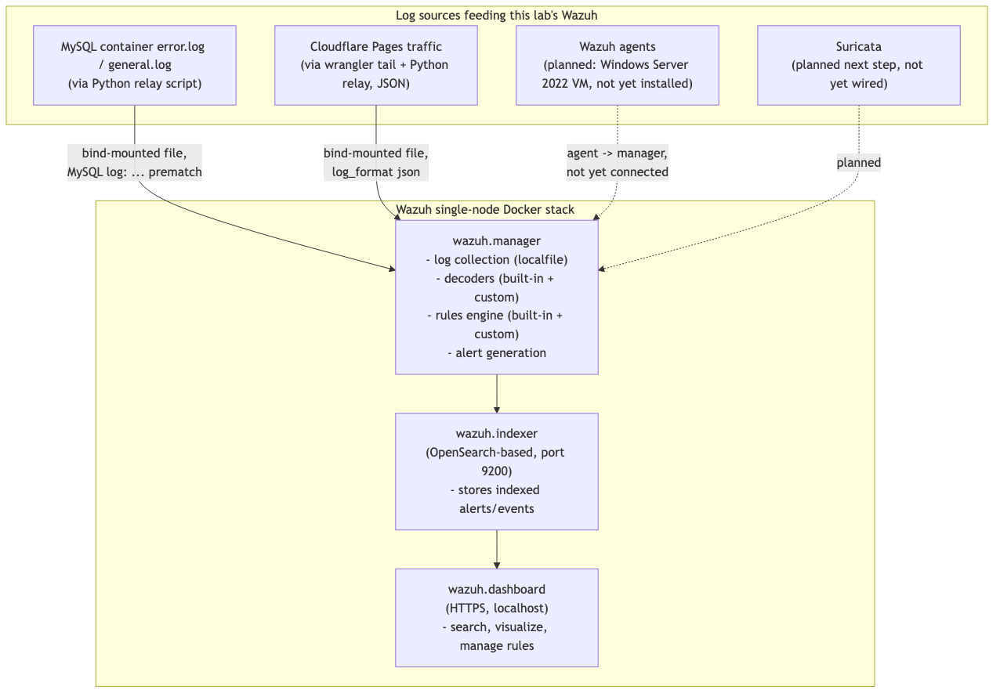
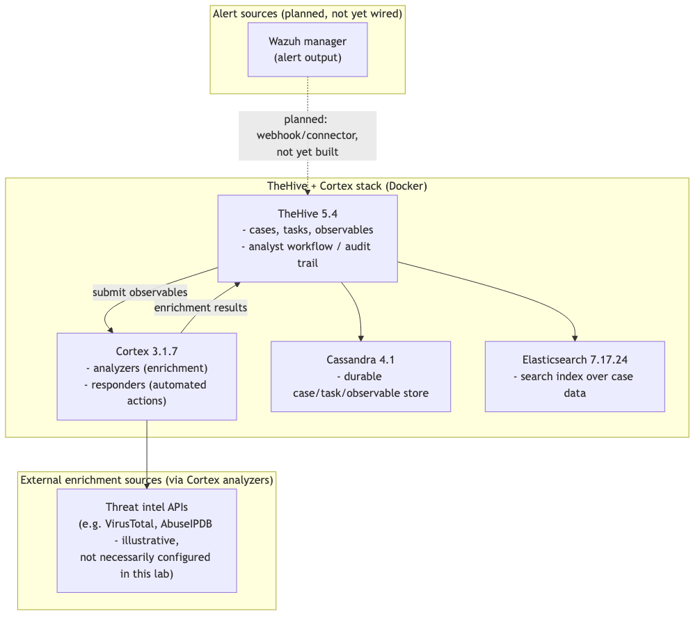
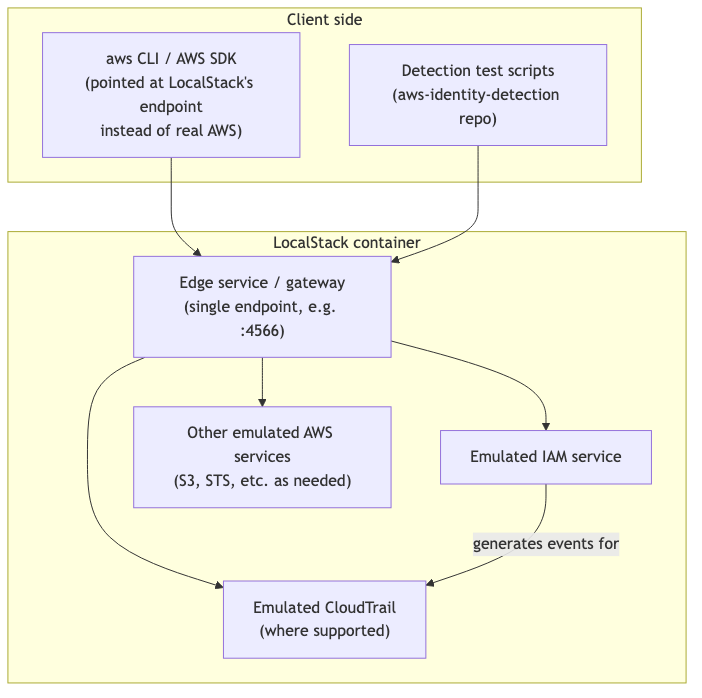

# Part 3.1-3.3: Wazuh, TheHive + Cortex, LocalStack

This section covers three of the tools running in this lab's local stack
(`~/securitylab/`) in real depth: Wazuh (the SIEM/XDR at the center of the
lab), TheHive + Cortex (the SOAR/case-management layer, built but not yet
wired to Wazuh), and LocalStack (AWS emulation for the
`aws-identity-detection` local lab). For each, this section covers what the
tool actually is and the architectural principle behind it, the honest
paid/free reality, concrete when-to-use/when-not-to guidance, the real
install and configuration steps as used in this lab, real troubleshooting,
and how the tool fits into the lab's overall data flow.

## 3.1 Wazuh

### What it is and the principle behind it

Wazuh **[FREE]** (Apache 2.0, fully self-hosted, no paid tier — the
commercial offering is paid support/cloud hosting, not a feature-gated
version of the software) is a SIEM/XDR platform built around an
**agent-plus-manager architecture**: lightweight agents run on monitored
hosts (or, as in this lab, log sources are fed in without a traditional
agent via file-based log collection), forward events to a central manager,
and the manager decodes, rules-matches, and indexes those events for
search and alerting.

The architectural principle worth understanding, because it explains
nearly every design decision downstream: Wazuh was built for **host and
network telemetry** — file integrity monitoring, log collection from
installed applications and OS-level sources (syslog, Windows Event Log,
audit logs), rootkit/malware detection, vulnerability detection against
installed software inventories, and configuration assessment (CIS
benchmarks). Its decoder/rule engine is designed around the shapes those
telemetry sources take: syslog-like text lines, structured-but-flat log
formats, and well-known application log formats it ships pre-built
decoders for (Wazuh ships decoders for things like MySQL's log format out
of the box — used directly in this lab, see below). This is fundamentally
different from what a cloud identity provider's audit log looks like — a
deeply nested JSON object like an Entra ID sign-in log, with dozens of
fields describing conditional access policy evaluation results, risk
detections, and device compliance state. Wazuh *can* ingest arbitrary JSON
(it auto-flattens top-level JSON keys into `data.<field>` for rule
matching when you set `<log_format>json</log_format>` on a log source —
used in this lab for the Cloudflare Pages traffic pipeline), but it has no
purpose-built understanding of what a sign-in log's fields *mean* the way
Microsoft Sentinel's `SigninLogs`/`AuditLogs` table schema does, with
native KQL operators tuned for exactly that data.

### Paid vs free tier reality

Fully free and open source — no artificial tier limits, no feature paywall,
no user-count cap. The only "paid" surface is Wazuh Inc.'s optional
commercial support/cloud-hosted offering, not used in this lab. This is a
big part of why it was chosen for the live lab at all.

### When to use this / when NOT to use this

Use Wazuh when the telemetry is genuinely host/network-shaped: endpoint
logs, file integrity events, application logs with a known text/line
format (or well-formed JSON), and you want a real, running, queryable SIEM
without paying for one. This lab's MySQL monitoring and Cloudflare Pages
traffic monitoring are both good fits for exactly this reason — they're
log-line and JSON-request telemetry respectively, and both were wired up
with zero or minimal custom decoder work.

Do NOT reach for Wazuh as the place to build out cloud identity provider
detection logic. This is the single most important honest judgment call in
this lab's design, worth restating explicitly: the Sigma rules and KQL
queries in the `detection-engineering` repo that target identity telemetry
(Entra ID sign-in logs, audit logs — things like impossible travel, MFA
fatigue, privilege escalation via role assignment) were deliberately **not**
ported into Wazuh's native rule XML format, even though Wazuh was the SIEM
actually running in this lab and porting them would have made for a more
"complete-looking" local demo. The reasoning: Wazuh's rule engine, decoder
model, and field-matching semantics are built for the shape of host/network
logs, not for the deeply nested, policy-evaluation-heavy shape of a cloud
IdP's sign-in event. Forcing an Entra sign-in log through Wazuh's JSON
auto-decode and writing pattern-matching rules against `data.*` fields
would technically run, but it would not reflect how anyone actually builds
identity detection content in practice — that content is written against
Sentinel's `SigninLogs`/`AuditLogs` schema and KQL because that's the tool
built for that telemetry shape, with native understanding of conditional
access results, risk levels, and location/device correlation that Wazuh
has no equivalent concept of. Keeping the Sigma/KQL content targeted at
Sentinel's schema, and *not* pretending Wazuh is an adequate substitute
SIEM for identity telemetry, is the more honest and more professionally
representative choice — even though it means the live Wazuh lab and the
identity detection content in the portfolio don't currently talk to each
other. That gap is real and stated plainly, not smoothed over.

### Internal architecture



The manager is the decode-and-detect engine; the indexer (OpenSearch-based)
is the storage/search backend; the dashboard is the web UI on top of the
indexer. All three run as separate containers in the official single-node
`wazuh-docker` compose setup, communicating over the compose network.

### Install and configuration as used in this lab

The lab uses the official `wazuh-docker` repository's single-node compose
setup, cloned to `~/securitylab/wazuh-docker`:

```bash
cd ~/securitylab
git clone https://github.com/wazuh/wazuh-docker.git -b v4.9.2
cd wazuh-docker/single-node
```

Before bringing the stack up, Wazuh's containers require TLS certificates
for inter-component communication (manager-to-indexer, dashboard-to-
indexer), generated by a dedicated `cert-generator` step defined in the
compose file. This is where a real, non-obvious bug shows up on first run:

**The cert-generator permissions bug.** The `wazuh-docker` single-node
compose setup runs a one-shot `generate-indexer-certs.yml`-style
cert-generator container that writes certificate files into a local
`config/wazuh_indexer_ssl_certs/` directory (bind-mounted from the host).
On some Docker Desktop configurations — this shows up especially with
certain host filesystem permission/ownership defaults on macOS — the
cert-generator container's write attempts into that bind-mounted directory
fail or produce certs owned in a way the subsequent `wazuh.indexer` and
`wazuh.dashboard` containers can't read at startup, and those containers
then fail to become healthy, typically surfacing as the indexer or
dashboard container repeatedly restarting or exiting with a TLS/cert-load
error in its logs rather than a clear permissions message up front.

The fix used in this lab: ensure the target certs directory exists and is
writable by the container's expected UID *before* running the
cert-generator step, and if certs were already partially generated with
wrong ownership, clear and regenerate them fresh:

```bash
# from wazuh-docker/single-node
rm -rf config/wazuh_indexer_ssl_certs
mkdir -p config/wazuh_indexer_ssl_certs
chmod -R 777 config/wazuh_indexer_ssl_certs   # permissive for the one-shot generator step; lab-only, not a production practice

docker compose -f generate-indexer-certs.yml run --rm generator
```

Once the generator step completes cleanly (its container exits with status
0, and cert files — CA, node certs, admin certs — appear in
`config/wazuh_indexer_ssl_certs/`), bring the main stack up:

```bash
docker compose up -d
```

Confirm all three containers report healthy:

```bash
docker compose ps
```

Expect `wazuh.manager`, `wazuh.indexer`, and `wazuh.dashboard` all in an
`Up (healthy)` state — the indexer in particular can take longer than the
other two to pass its health check on first start, since it's doing
OpenSearch cluster initialization.

Access the dashboard at `https://localhost` (self-signed cert — the
browser will warn, this is expected for a local lab) and the indexer API
directly at `:9200`. **The default credentials are `admin` /
`SecretPassword`.** This is explicitly and deliberately documented here as
a "change this" item, not a real secret — any real or long-running
deployment of this stack must change the default indexer/dashboard
credentials (Wazuh documents the process via its `wazuh-indexer` internal
users config) before it's exposed to anything beyond localhost, and even
for a localhost-only lab, leaving defaults in place is a habit worth
breaking early.

### The MySQL pipeline, as a concrete worked example

This lab stood up a real MySQL 8.0 container (`soc-lab-mysql`) specifically
as a monitored/attacked target, with general query logging and error
logging both enabled. Wazuh ships built-in decoders and rules for MySQL's
log format already —
`ruleset/decoders/0150-mysql_decoders.xml` and
`ruleset/rules/0295-mysql_rules.xml` — so no custom Wazuh rule was written
for this source; the built-in ruleset was sufficient.

The integration challenge wasn't detection logic, it was **getting the log
lines into the shape Wazuh's built-in decoder expects**. A small Python
relay script tails MySQL's `error.log`/`general.log`, reformats matching
lines to fit Wazuh's expected `MySQL log: ...` prematch format, and appends
them to a file bind-mounted into the `wazuh.manager` container, where a
`<localfile>` block configured with `<log_format>syslog</log_format>`
picks them up:

```xml
<localfile>
  <log_format>syslog</log_format>
  <location>/var/ossec/logs/mysql/relayed.log</location>
</localfile>
```

Verified live in this lab: four deliberate wrong-password login attempts
against the MySQL container correctly fired Wazuh's built-in rule **50106**
("MySQL: authentication failure", level 9), which — because it's a
built-in rule, not a custom one — came with Wazuh's out-of-the-box
regulatory compliance mapping already attached (PCI DSS, GDPR, HIPAA, NIST
800-53 control references appear directly on the alert). This is a good
concrete illustration of the "use Wazuh for what it's built for" principle
above: because MySQL log format is squarely inside Wazuh's home turf, this
integration needed a small format-adapter script and zero custom detection
logic.

### The Cloudflare Pages pipeline, as a second worked example

A real public Cloudflare Pages site (`soc-lab-target.pages.dev`,
Cloudflare Pages **[FREEMIUM]** — static hosting is free, but continuous
log streaming/Logpush needs a paid plan, which is exactly why this lab
uses `wrangler pages deployment tail` as a workaround instead) logs every
real request via a Pages Function
(`functions/_middleware.js`) using `console.log` — method, path, client IP
via `cf-connecting-ip`, country, user-agent. Since the free tier has no log
retention, a Python relay parses `wrangler pages deployment tail
--format=json` output live and appends it to a file Wazuh watches with
`<log_format>json</log_format>` — Wazuh auto-flattens top-level JSON keys
into `data.<field>` for rule matching here, so no custom *decoder* was
needed, but (unlike the MySQL case) a custom *rule* was, since Wazuh has no
built-in decoder or ruleset for arbitrary web request JSON the way it does
for MySQL. A custom local rule (id **100011**, level 7) fires on any
request to `/login.html`, framed as "possible scanner/credential-testing
activity" given the page does nothing real. Verified live with real curl
traffic producing real alerts.

### Troubleshooting

- **Containers never reach `healthy`**: check `docker compose logs
  wazuh.indexer` first — indexer startup failures (often cert-related, see
  above) cascade into dashboard failures since the dashboard depends on a
  healthy indexer. Don't debug the dashboard container first; work bottom-up.
- **Cert-generator permission errors**: covered above — clear the certs
  directory, ensure it's writable, rerun the generator before `docker
  compose up`.
- **Default credentials**: `admin`/`SecretPassword` must be treated as a
  "day one, change this" item — worth doing even before you consider the
  lab "done," since it's a five-minute fix and a real bad habit to leave in
  place.
- **JSON log source producing no alerts**: confirm `<log_format>json</log_format>`
  is set (not `syslog`) on that specific `<localfile>` block, and confirm
  the custom rule's XPath/field references match the actual
  `data.<field>` names Wazuh flattened the JSON into — check via the
  dashboard's alert JSON view on a raw (non-matching) event first to
  confirm field names before writing the rule.
- **Resource pressure on a 16GB host**: the indexer (OpenSearch) is the
  heaviest of the three containers; if the Mac becomes sluggish with
  multiple stacks running, this is usually the first place to check memory
  usage (`docker stats`).

### How Wazuh fits into the overall lab architecture

Wazuh is the lab's central SIEM — the place host/network/application
telemetry converges, gets decoded, and gets rule-matched into alerts. As of
this document, it consumes MySQL logs and Cloudflare Pages traffic, with
Suricata network IDS output and a Wazuh agent on the Windows Server VM both
identified as the next real sources to wire in (neither done yet). It does
not currently forward alerts anywhere — TheHive/Cortex are built but not
wired to consume Wazuh alerts, which is a stated, real gap, not an oversight.

## 3.2 TheHive + Cortex

### What it is and the principle behind it

TheHive **[FREE]** (TheHive 5 is open source under AGPL for self-hosted
use — StrangeBee, the company behind it, also sells a commercial
"TheHive:Cloud"/enterprise offering, but the self-hosted version run in
this lab is free) is a case-management/SOAR platform: it exists to take
raw alerts and turn them into structured, trackable **cases** with
observables (IPs, hashes, domains, etc.), tasks, and an audit trail of
analyst actions — the workflow layer a SIEM like Wazuh doesn't provide on
its own. Cortex **[FREE]**, same licensing model, is TheHive's companion
enrichment/response engine: it runs "analyzers" (enrichment lookups against
threat intel sources, sandboxes, reputation services) and "responders"
(automated actions) against observables submitted to it, either manually
or triggered from TheHive.

The architectural principle: a SIEM's job is detection (turn raw telemetry
into an alert); a SOAR's job is response workflow (turn an alert into a
tracked investigation with enrichment, assignment, and resolution status).
They're deliberately separate concerns with separate tools in this lab's
design — Wazuh does not attempt to be a case-management system, and TheHive
does not attempt to be a log-search/detection engine. TheHive's own
architecture reflects a document-oriented workflow (cases, tasks,
observables, as first-class linked objects) backed by a search index for
querying across cases — hence Cassandra (the durable document/case store)
plus Elasticsearch (search) as its two backing data stores, a heavier
footprint than a typical single-database app, but one that maps directly to
"store structured case data durably, and make it fully searchable" as two
genuinely different jobs.

### Paid vs free tier reality

Self-hosted TheHive 5 and Cortex are both free and fully functional with
no artificial feature gating for this lab's purposes — the commercial
offering from StrangeBee is a hosted/managed version plus enterprise
support, not a more-capable version of the self-hosted software for
core case-management functionality.

### When to use this / when NOT to use this

Use TheHive+Cortex when you actually have a volume or complexity of alerts
that benefits from structured case tracking and repeatable enrichment
workflows — multiple analysts, an audit-trail requirement, or enrichment
lookups you want automated (Cortex analyzers) rather than manually run
every time. Its value is entirely dependent on having something feeding it
alerts in the first place; a SOAR platform with nothing wired into it is
just an empty case-tracking UI.

Do NOT stand this up expecting it to add value on day one of a small lab —
and this is the honest, stated state of this lab right now: TheHive/Cortex
are built and their containers exist, but they are currently **stopped/
idle**, and — more importantly — **not actively wired to Wazuh's alerts**.
That's a known, documented gap, not a hidden one. The realistic sequence
for a lab this size is: get a SIEM producing real alerts first (done, via
Wazuh), then build the alert-forwarding integration (Wazuh has a native
TheHive connector/webhook path for this), and only then does running
TheHive continuously start paying for its own resource cost. Running it
idle "because it's part of the architecture" without a live feed is a fair
thing to note in a portfolio as planned/next-step work, but running it
disconnected from real alerts on a resource-constrained 16GB host with no
current benefit is not worth the standing memory cost.

### Internal architecture



### Install and configuration as used in this lab

TheHive's stack was brought up previously via Docker Compose, defining
Cassandra, Elasticsearch, Cortex, and TheHive as four services on a shared
compose network — Cassandra and Elasticsearch as the backing stores, Cortex
as a separate service TheHive is configured to talk to via its API URL and
an API key generated in Cortex's own first-run setup, and TheHive itself
as the top-level UI/API service.

The general shape of that compose bring-up:

```bash
cd ~/securitylab/thehive-project   # illustrative path, matches this lab's actual layout convention
docker compose up -d
docker compose ps
```

First-run configuration order matters and is a real, non-obvious part of
getting this stack working: Elasticsearch and Cassandra need to be healthy
before Cortex and TheHive can successfully connect to their respective
backing stores, and Cortex itself needs its initial admin account and
organization created through its own web setup wizard *before* an API key
can be generated for TheHive to use to talk to it. The practical sequence:
bring the stack up, wait for Cassandra/Elasticsearch to report healthy,
open Cortex's UI first and complete its setup wizard (creates the initial
superadmin, then an organization, then an analyzer-running user with an API
key), then configure that key into TheHive's connector settings for Cortex
integration, then finally open TheHive's own UI and complete its first-run
setup (initial org, initial admin user).

**Default credentials** are another explicit "must change" item here, same
principle as Wazuh: both TheHive and Cortex prompt for initial
admin/org setup on first launch rather than shipping a fixed default login,
which is a better default than Wazuh's fixed admin/SecretPassword — but
whatever password is set during that first-run wizard needs to be treated
with the same seriousness as any other credential, not left as a
throwaway lab password if this stack is ever exposed beyond localhost.

### Troubleshooting

- **Elasticsearch fails to start / exits immediately**: Elasticsearch 7.x
  has real host-level requirements — most commonly `vm.max_map_count`
  needing to be raised (a classic Elasticsearch-in-Docker issue, not
  specific to this stack) — check container logs for a
  `max virtual memory areas vm.max_map_count [65530] is too low` message,
  which is the concrete symptom if this hasn't been set on the Docker
  Desktop VM.
- **Cortex can't reach Elasticsearch/TheHive can't reach Cassandra**:
  usually a startup-ordering issue — confirm both backing stores show
  healthy in `docker compose ps` before troubleshooting the app-layer
  services that depend on them.
- **Containers "up" but the UI never becomes reachable**: check that the
  expected ports aren't already bound by another stack — this is a real
  risk in a lab running several Docker Compose projects side by side, and
  worth checking with `docker ps` across all running containers, not just
  this stack's `docker compose ps`.
- **x86 emulation slowness is not the cause of any of the above**: worth
  noting for clarity — TheHive's containers are typically available as
  native arm64 images or run fine under Docker Desktop's transparent
  emulation without the severe slowness seen in the Windows QEMU VM; if
  this stack feels slow, it's far more likely genuine resource contention
  (Cassandra and Elasticsearch are both JVM-heavy) on a 16GB host running
  multiple stacks at once than architecture emulation overhead.

### How TheHive + Cortex fits into the overall lab architecture

Intended role: the case-management/response layer downstream of Wazuh —
Wazuh alerts would forward into TheHive as cases, Cortex would enrich
observables extracted from those alerts. Actual current state: built,
capable, currently idle, and explicitly not yet wired to Wazuh's alert
output. This is the most honestly-stated gap in the lab's architecture and
worth presenting as exactly that in this document — a real next step, not
a finished integration.

## 3.3 LocalStack

### What it is and the principle behind it

LocalStack **[FREEMIUM]** (the Community edition used in this lab is free
and open source, covering core services like IAM, S3, and CloudTrail
emulation sufficient for this lab's purposes; LocalStack Pro is a paid tier
adding more services and features, not needed here) emulates AWS service
APIs locally, so code and detection logic written against real AWS APIs
(the AWS SDK, `aws` CLI) can run against a local emulated endpoint instead
of a real AWS account. The principle: for testing detection logic — e.g.
"does this IAM privilege-escalation pattern actually get logged the way I
expect, and does my detection query actually catch it" — you need to
generate the *shape* of real AWS API activity and its logs, but you do not
need (and for cost/safety reasons, usually do not want) to do that against
a billed, real AWS account, especially when deliberately generating
privilege-escalation-shaped activity for test purposes.

### Paid vs free tier reality

LocalStack Community **[FREE]** covers the core services this lab's
`aws-identity-detection` work needs — IAM, and enough surrounding service
emulation to exercise privilege-escalation-relevant API calls. LocalStack
Pro is a paid subscription adding broader service coverage and features
like advanced persistence — not required for this lab's stated purpose.

### When to use this / when NOT to use this

Use LocalStack when you want to exercise AWS API call patterns and their
logging/detection surface without touching a real, billed AWS account —
exactly the `aws-identity-detection` use case here: testing that IAM
privilege-escalation detection logic actually fires against realistic API
call sequences, safely and repeatably, without needing a real AWS account
or worrying about cost or blast radius from deliberately-risky test
actions.

Do NOT treat LocalStack's emulation as a perfect stand-in for real AWS
behavior, especially for identity/IAM edge cases — service emulation
fidelity varies by service and by LocalStack edition, and IAM policy
evaluation semantics in particular are complex enough that subtle real-AWS
behavior (specific deny-precedence edge cases, service-specific resource
policies, actual CloudTrail event field completeness) is not guaranteed to
be bit-for-bit replicated locally. LocalStack is the right tool for
building and dry-running detection logic against realistic API call
*shapes* cheaply; it is not a substitute for eventually validating that
same detection logic against a real AWS account's real CloudTrail output
before trusting it in production. This lab is honest that its
`aws-identity-detection` content has been validated against LocalStack, not
against a real AWS account — the same "don't overclaim" discipline applied
elsewhere in this document (e.g. terraform-labs never having been `apply`'d
for real).

### Internal architecture



LocalStack's architecture is a single container exposing one edge endpoint
(by default port 4566) that internally routes requests to the correct
emulated service implementation based on the AWS API being called — from
the client's perspective it looks like one AWS-shaped endpoint, which is
exactly the point: existing AWS CLI/SDK code needs only an endpoint-URL
override to run against it, not a rewrite.

### Install and configuration as used in this lab

```bash
cd ~/securitylab/aws-identity-detection-lab   # illustrative path matching this lab's layout convention
docker compose up -d localstack
docker compose ps
```

A typical LocalStack compose service definition looks like:

```yaml
services:
  localstack:
    image: localstack/localstack:3.8
    ports:
      - "4566:4566"
    environment:
      - SERVICES=iam,sts,cloudtrail,s3
      - DEBUG=0
    volumes:
      - "./localstack-data:/var/lib/localstack"
```

Point the AWS CLI at it explicitly per-command with `--endpoint-url`, or
configure a dedicated profile so it's not accidentally used against real
AWS:

```bash
aws --endpoint-url=http://localhost:4566 iam create-user --user-name test-privesc-user
aws --endpoint-url=http://localhost:4566 iam list-users
```

Using a distinct named AWS CLI profile (e.g. `aws configure --profile
localstack` with dummy access keys — LocalStack does not validate real AWS
credentials by default) is worth doing deliberately, specifically to avoid
the real risk of a copy-pasted command accidentally running against a real
AWS account because the default profile was active. This is a genuine
operational safety habit worth stating plainly, not a hypothetical concern.

### Troubleshooting

- **`docker info`/connection-refused on port 4566**: same root cause
  category as Docker Desktop issues elsewhere in this document — confirm
  the container is actually running (`docker compose ps`) and the port
  mapping matches what your CLI/SDK is targeting.
- **A service call returns "not implemented" or an unexpected error**: check
  that the specific AWS service is listed in the `SERVICES` environment
  variable for the container (Community edition emulates a defined set of
  services — an unlisted service simply isn't available) and check
  LocalStack's own compatibility notes for that specific API action, since
  emulation completeness varies per action within a service, not just per
  service.
- **Detection logic passes against LocalStack but needs re-validation
  before being trusted**: not a bug to "fix," but the correct honest
  framing to carry forward — LocalStack validation is a real, useful step,
  not a final one, for exactly the IAM-policy-nuance reasons above.
- **Apple Silicon note**: LocalStack ships native arm64-compatible images,
  so this is one of the few pieces of this lab's stack that does *not*
  suffer the x86 emulation slowness the Windows Server VM does under QEMU
  — worth explicitly distinguishing from the QEMU case so the two aren't
  conflated as "the same kind of slow."

### How LocalStack fits into the overall lab architecture

LocalStack is scoped narrowly and intentionally: it exists solely to
support the `aws-identity-detection` repo's local lab, letting AWS
IAM/privilege-escalation detection content be exercised against realistic
API call shapes without a real AWS account. It does not feed Wazuh, TheHive,
or any other part of this lab's stack — it's a self-contained test harness
for one specific repo's detection content, currently stopped/idle between
active development sessions, which is the appropriate operating mode for a
tool whose job is "be available when testing that specific content," not
"run continuously as part of the lab's live telemetry pipeline."
