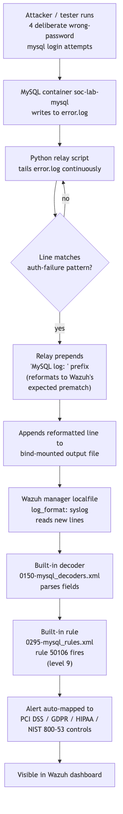
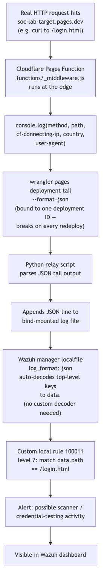

**Part 3.4-3.7: Suricata, MySQL, Cloudflare Pages + Workers/Functions, Auth0**<!--h1-->

This part covers four very different kinds of monitored target in the lab:
a network intrusion detection engine that is now fully fixed and wired in
(Suricata), a database that was stood up specifically to be attacked and
watched (MySQL), a real, live, public web target whose logs have to be
smuggled out of a platform that doesn't want to give them to you for free
(Cloudflare Pages + Functions), and a real identity provider whose System
Log is a fourth live, verified detection source (Auth0). Read together,
they make a useful point: how much detection work a target needs depends
entirely on how close its native log format already is to what your SIEM
expects. MySQL needed zero custom Wazuh rules or decoders. Suricata,
once two silent config bugs were fixed, also needed no custom rule or
decoder — its ET ruleset alert fired straight through Wazuh's own
built-in Suricata decoder/rule, the same "no custom content needed"
outcome as MySQL, for a different underlying reason (Wazuh ships a
built-in Suricata decoder path the same way it does for MySQL's log
format). Cloudflare needed a custom rule but no custom decoder. Auth0
needed a custom rule set, because Wazuh ships no built-in Auth0 decoder —
like Cloudflare, not like MySQL or Suricata. That contrast is the
throughline of this part.

**Part 3.4: Suricata — Network Intrusion Detection**<!--h2-->

**What a network IDS actually does**<!--h3-->

**Suricata** **[FREE]** (open source, GPLv2, maintained by the Open
Information Security Foundation) is a network intrusion detection and
prevention engine (NIDS/NIPS). At the level that matters for this lab, a
network IDS sits somewhere it can see raw traffic — a mirrored switch
port, a tap, a container network namespace, a host interface in promiscuous
mode — and inspects packets as they cross the wire, independent of whatever
the endpoint itself logs or doesn't log. This is a fundamentally different
vantage point from everything else in this lab so far. Wazuh's other
inputs (MySQL logs, Cloudflare Function logs) are all *application-layer,
after-the-fact* records: something already decided to write a log line, and
Wazuh consumes that decision. A NIDS doesn't wait for an application to
decide to log anything. It sees the packets themselves, so it can catch
things no application log would ever mention — a port scan, a C2 beacon
using a protocol nobody instrumented, a plaintext credential crossing the
wire in a protocol that was never supposed to carry it in the clear.

**Signature-based detection vs anomaly detection**<!--h3-->

Suricata (like its predecessor/sibling Snort) is primarily a
**signature-based** engine, though it supports some anomaly-style features.
The distinction matters and is worth being precise about:

**Signature-based detection** matches traffic against a database of known
patterns — a specific byte sequence in a payload, a specific combination of
protocol fields, a known-bad IP or domain, a regex against a URL. Suricata
uses rules written in a specific syntax (largely compatible with Snort's
rule language), for example a simplified illustrative rule shape:

```
alert tcp any any -> $HOME_NET 3306 (msg:"Possible MySQL brute force";
  flow:to_server; content:"|4d 79 53 51 4c|"; threshold:type both, track by_src,
  count 5, seconds 60; sid:1000001; rev:1;)
```

(This is an illustrative example of the rule *shape*, not a rule that has
been written, loaded, or tested against Suricata in this lab.) The rule
that actually fired in this lab, by contrast, is a real one — sid
**2036252**, "ET SCAN RDP Connection Attempt from Nmap", from the free ET
Open ruleset, and it's covered in full below. The strength of signature-based
detection is precision: when a signature fires, you know exactly what
matched and why, which makes triage fast and false-positive tuning
tractable. The weakness is coverage: a signature-based engine can only
catch what someone already wrote a signature for. Zero-days, novel
malware, and attackers who deliberately avoid known IOCs sail straight
through.

**Anomaly-based detection** (statistical baselining, machine-learning
classifiers, protocol-anomaly detection) instead tries to learn what
"normal" traffic looks like for an environment and flag deviations from
that baseline — a host that suddenly starts talking to a hundred new
destinations, a protocol used at a volume or time-of-day it's never used
at before. The strength is that it can catch genuinely novel attacks with
no prior signature. The weakness is noise: baselines drift, "normal" is
messy in a real network, and anomaly detectors are notorious for high
false-positive rates unless heavily tuned — which is itself a nontrivial
ongoing labor cost, not a one-time setup cost.

In production, the two approaches are complementary, not competing:
signature-based engines like Suricata catch known-bad fast and cheap;
anomaly/behavioral layers (increasingly, this is what "XDR" vendors sell as
their differentiator on top of a base like this) catch what signatures
miss, at the cost of more tuning and more analyst judgment on each alert.

**Suricata is now fully fixed and wired to Wazuh — two silent bugs and a Docker-networking workaround**<!--h3-->

Suricata's container (`jasonish/suricata:latest`), built previously in this
lab, is now **fixed and actually wired to Wazuh**, verified with real
traffic — a real change from the earlier state of this document, where
Suricata was a stopped container producing nothing. Getting there required
finding and fixing two real, silent bugs plus one genuine architectural
workaround, and all three are worth walking through because each is a
realistic, non-obvious failure mode.

**Bug 1: `eve-log` nested under the wrong config key.** Suricata's
`suricata.yaml` expects the `eve-log` output block to live under the
top-level `outputs:` key. In this lab's config it had been nested under
`logging:` instead — a plausible-looking but wrong location, since
`logging:` is a real top-level key in `suricata.yaml` that governs
Suricata's *own* application log verbosity, not the `eve.json` event
output. Suricata started fine with `eve-log` in the wrong place — there was
no startup error — it simply never wrote `eve.json` at all, because the
config block that should have enabled it was never read as an `outputs:`
entry.

**Bug 2: `HOME_NET`/`EXTERNAL_NET` never defined.** Suricata's rules
almost universally reference the `$HOME_NET` and `$EXTERNAL_NET` variables
(visible in the illustrative rule shape above) rather than hardcoded IP
ranges, specifically so the same rule works across different network
layouts. Neither variable was ever defined in this lab's `suricata.yaml`.
An undefined variable referenced by a rule doesn't produce a loud error
either — it silently disables every single rule that references it, which
in practice is nearly the entire default ruleset, since almost every rule
is written in terms of traffic between `$HOME_NET` and `$EXTERNAL_NET`.
Two silent misconfigurations, neither of which produced an obvious error
message, together meant Suricata could have been "running" indefinitely
while doing effectively nothing.

**Bug 3: 16 Modbus/DNP3 rules that fail to parse.** Separately, 16 rules
referencing the Modbus and DNP3 application-layer protocols failed to
parse, because those app-layer parsers are disabled in this lab's
configuration — there is no ICS/SCADA equipment in this lab for them to
ever have anything to inspect. Rather than leave those 16 rules generating
load errors on every start, they were excluded via a `disable.conf` file,
which is Suricata's supported mechanism for deliberately excluding
specific rule IDs from being loaded at all.

**The Docker-networking workaround: a dedicated bridge network, not host
networking.** Docker Desktop on macOS does not give containers real access
to the host's actual network interfaces, even when a container is
configured with host networking — Docker Desktop on macOS runs containers
inside a Linux VM, so "host networking" only reaches that VM's virtual
network, not the Mac's real Wi-Fi/Ethernet interface the way it would on
native Linux Docker. That ruled out the obvious approach of pointing
Suricata at a real host interface in promiscuous mode. The actual fix:
Suricata was attached to its own **dedicated Docker bridge network**, and
real inter-container traffic was generated for it to observe on that
bridge — specifically, a real Python socket connection sending Nmap's
literal RDP-scan cookie bytes to a plain `netcat` listener, with both ends
of that connection also on the same bridge network Suricata was watching.

**The verified result.** That traffic produced a real ET ruleset alert —
**"ET SCAN RDP Connection Attempt from Nmap", sid 2036252** — which fired
through **Wazuh's own built-in Suricata decoder/rule (id 86601)**. No
custom Wazuh rule or decoder was needed for this to work, which puts
Suricata in the same category as MySQL rather than Cloudflare: Wazuh
already ships a Suricata decoder/rule path, the integration work here was
entirely about getting real EVE JSON actually flowing (fixing the two
silent config bugs) and getting real traffic in front of Suricata at all
(the bridge-network workaround) — not about writing new detection content.

**When to use this / when NOT to use this**<!--h3-->

Use a NIDS like Suricata when you need visibility into traffic your
endpoints and applications don't or can't log — lateral movement between
hosts that never touches an instrumented application, C2 beaconing,
protocol misuse, traffic to/from known-bad infrastructure. Don't expect it
to replace endpoint or application logging — it has zero visibility into
what happens *inside* an encrypted TLS session past the handshake/SNI
(without TLS interception, which this lab does not do and which carries
its own significant tradeoffs), and it says nothing about what a user did
once authenticated. In this lab specifically: Suricata is now a real,
verified, wired-in source — but it's worth being precise about the shape
of that verification: the traffic it detected was deliberately generated
on a dedicated Docker bridge network built for this purpose, not traffic
crossing the Mac's real network interface, because Docker Desktop on macOS
genuinely cannot give a container that visibility. Anyone reading this as
"Suricata is monitoring this laptop's real network traffic" would be
overstating what was actually built.

**Part 3.5: MySQL as a Monitored, Attacked Lab Target**<!--h2-->

**Why a real MySQL container**<!--h3-->

A real MySQL 8.0 container (`soc-lab-mysql`) — **[FREE]** (MySQL Community
Edition, GPL) — was stood up in this lab session specifically to be a
monitored and attacked target, not a functional application backend. The
point was to generate real authentication log lines from real failed
login attempts and prove those lines reach Wazuh and fire a real rule —
end to end, not simulated.

**general_log vs error_log — and why that distinction is a real production tradeoff**<!--h3-->

MySQL ships (at minimum) two separate logging subsystems relevant here,
and conflating them is a common mistake:

- **error_log** — logs server-level events: startup/shutdown, crashes,
  and, critically for this lab, **authentication failures** (failed login
  attempts show up here as `Access denied for user '...'@'...'`). This
  log is bounded in practice — it only writes on events that actually
  matter (errors, warnings, connection failures), so its volume is
  proportional to how much is going *wrong*, not to overall traffic.
- **general_log** (the general query log) — logs *every single statement*
  the server executes: every `SELECT`, every `INSERT`, every connection
  and disconnection, from every client, successful or not. This started
  out enabled unconditionally in this lab and hit **13MB from just a few
  minutes of testing** — a real, concrete illustration of exactly the
  unbounded-growth cost described below, not a hypothetical one. It now
  starts **off by default**, with a small `on`/`off`/`rotate` toggle
  script, and is only switched on for the duration of an actual test
  scenario rather than left running continuously.

The reason this distinction matters far beyond this lab is a real,
recurring production tradeoff: **general_log gives you complete audit
visibility — literally every query anyone ran — but at unbounded,
traffic-proportional cost.** On a busy production database, the general
query log can dwarf the actual data volume of the database itself in
short order, because it captures full statement text for every single
query, all the time. That has three concrete costs: disk (the log file
grows without bound if not rotated aggressively), I/O performance (every
query now incurs an extra synchronous or buffered write to the log target,
which for `FILE` output competes with the database's own I/O), and
potentially very serious data-exposure risk (query text often contains
literal values — including, in a badly designed application, plaintext
credentials or PII passed as query parameters — sitting in a log file with
whatever access controls that file happens to have, which are usually
much looser than the database's own access controls). This is precisely
why general_log is *off by default* in MySQL and why production DBAs
enable it only surgically — for a bounded diagnostic window, or filtered
to specific users/statement types — rather than leaving it on
indefinitely. This lab now follows that same discipline instead of being
an exception to it: after general_log hit 13MB from just a few minutes of
unconditional testing, it was switched to starting off by default, with
a small toggle script (`on`/`off`/`rotate`) to enable it only for the
duration of a specific test scenario. A security engineer reading this
should not walk away thinking "just turn general_log on in production" —
and this lab's own 13MB-in-minutes experience is the concrete illustration
of why not, not just the abstract argument for it.

**Wazuh's built-in MySQL decoder and rules**<!--h3-->

Wazuh ships built-in support for MySQL's log format out of the box, in two
files inside its default ruleset:

- `ruleset/decoders/0150-mysql_decoders.xml` — the decoder(s) that parse a
  MySQL log line into fields Wazuh's rule engine can match against.
- `ruleset/rules/0295-mysql_rules.xml` — the rule definitions that fire
  based on what the decoder extracted, including rule ID **50106**,
  "MySQL: authentication failure" (level 9).

This is the single biggest practical difference between the MySQL
integration and the Cloudflare integration described in Part 3.6: **no
custom Wazuh rule or decoder was needed for MySQL at all.** Wazuh already
speaks MySQL's log dialect natively. The only integration work required
was getting MySQL's actual log lines into the exact shape Wazuh's existing
decoder is written to expect.

**The prematch problem, and how the relay bridges it**<!--h3-->

Wazuh's built-in MySQL decoder is written around a specific `prematch`
pattern — conceptually, it expects to see a log line that begins with a
literal string resembling `MySQL log: ` followed by the actual event text
(this is the decoder's anchor for "this line is MySQL, hand it to the
MySQL decoding logic"). Real MySQL log output — whether from
`error.log` or `general.log` — does **not** naturally start with that
string. MySQL writes its own native format (timestamped, with its own
prefix conventions per log type), and it has no setting that reformats its
output to match an arbitrary third-party SIEM's expected prematch string.

This is the gap a small **Python relay script** exists to bridge. The
relay's job, conceptually, is:

1. **Tail** MySQL's `error.log` and `general.log` files continuously
   (the same tailing-a-growing-file pattern used elsewhere in this lab,
   e.g. the Cloudflare `wrangler tail` relay, though this one reads local
   files directly rather than a streaming CLI).
2. **Filter/match** each new line against the patterns that indicate an
   event Wazuh's decoder cares about — in particular, authentication
   failure lines (`Access denied for user ...`).
3. **Reformat** each matching line by prepending the literal
   `MySQL log: ` prefix (and otherwise preserving the original event text)
   so the resulting line is byte-for-byte shaped the way Wazuh's built-in
   `0150-mysql_decoders.xml` decoder is written to expect.
4. **Append** the reformatted line to a separate output file that is
   bind-mounted into the Wazuh manager container's filesystem.
5. Wazuh's manager, via a `<localfile>` block configured with
   `<log_format>syslog</log_format>` pointed at that bind-mounted file
   path, picks up each new appended line, runs it through the decoder
   pipeline, and — because the line now matches the expected prematch —
   the MySQL decoder successfully parses it and hands it to the rule
   engine.

The relay is, in effect, a translation layer between "the log format the
source software actually writes" and "the log format the SIEM's built-in
content was written to expect." This is an extremely common real-world
pattern — very few security tools' out-of-the-box decoders match an
arbitrary application's actual log output byte-for-byte, and the practical
fix is almost always a small normalization step ahead of ingestion, not
rewriting the SIEM's decoder.



**The verified result**<!--h3-->

This was verified live, not simulated: **4 deliberate wrong-password login
attempts** against `soc-lab-mysql` produced 4 corresponding
`Access denied` lines in MySQL's error log, which the relay picked up,
reformatted, and appended to the bind-mounted file, which Wazuh's manager
ingested and correctly decoded, causing **rule 50106 ("MySQL:
authentication failure", level 9)** to fire. Because this rule already
ships in Wazuh's default ruleset with compliance mappings attached, the
resulting alert automatically carried **PCI DSS, GDPR, HIPAA, and NIST
800-53** control references — no manual mapping work was required, purely
because the rule was already tagged that way in Wazuh's shipped content.
This is a useful, honest illustration of what "compliance mapping" means
in a SIEM in practice: it's metadata attached to a rule ahead of time by
whoever wrote the rule, surfaced automatically when the rule fires — not
something computed dynamically from the alert content, and not something
this lab built itself.

**When to use this / when NOT to use this**<!--h3-->

Use built-in vendor decoders/rules whenever the target software is common
enough that the SIEM vendor already wrote content for it — MySQL, SSH,
sudo, Windows Security Event Log, and similar high-prevalence sources
usually have mature built-in coverage in Wazuh, and reinventing that
coverage from scratch is wasted effort. Do NOT assume built-in coverage
means zero integration work, though — as shown here, the log source still
has to actually reach the SIEM in the format the decoder expects, and
bridging "real log format" to "decoder-expected format" is very often
still necessary, via a relay/normalization step exactly like the one built
here. Do not enable full general query logging on anything that isn't a
disposable lab target without deliberately weighing the disk, I/O, and
data-exposure costs described above.

**Part 3.6: Cloudflare Pages + Workers/Functions**<!--h2-->

**Static hosting vs edge compute — the distinction that matters here**<!--h3-->

**Cloudflare Pages** **[FREEMIUM]** (static hosting is free; Logpush/log
retention requires a paid plan — the specific limit that matters most for
this lab, explained below) is, at its core, a static site host: it serves
pre-built HTML/CSS/JS files from Cloudflare's edge network, with no
server-side execution per request by default. **Cloudflare
Pages Functions** (built on the same underlying platform as **Cloudflare
Workers** **[FREEMIUM]**, free tier with a daily request-count cap) add
edge *compute* on top of that static hosting — small JavaScript functions
that execute at Cloudflare's edge, in front of or alongside the static
content, for every matching request. This is the same static-vs-dynamic
distinction that shows up everywhere in web architecture, just pushed all
the way out to the CDN edge instead of living in an origin server: static
hosting alone cannot observe, log, or react to individual requests beyond
what the CDN's own access logs might capture (and on Free tier, as below,
that's effectively nothing persistent); a Function can run arbitrary code
on every request — including, as built here, logging it.

**The lab's real setup**<!--h3-->

The live target is `soc-lab-target.pages.dev`, a real, public, Free-tier
Cloudflare Pages site — three static pages (a home page, a dummy
`/login.html` that logs to the browser console and does nothing else, a
dummy `/contact.html`), every page tagged `noindex,nofollow` and carrying
an on-page banner disclosing plainly that this is a synthetic lab fixture,
not a real company, and collects nothing. A Cloudflare Pages Function at
`functions/_middleware.js` runs on every real request to the site and logs
method, path, client IP (via the `cf-connecting-ip` header Cloudflare
attaches), country, and user-agent via `console.log`.

**Why Free tier has no Logpush, and what that means practically**<!--h3-->

Cloudflare's **Logpush** product — continuous, durable streaming of
request/log data out to an external destination (S3, a SIEM, etc.) — is a
paid-plan feature. On Free tier, `console.log` output from a Pages
Function exists only transiently, surfaced through Cloudflare's real-time
tailing tooling, with **no built-in persistence** and no way to query
"what happened yesterday" after the fact. Practically, this means the
Free tier gives you *visibility into traffic happening right now, while
you are actively watching*, and nothing else — there is no log storage
to fall back on, no historical query capability, nothing to backfill from
if you weren't tailing at the moment a request happened. Any persistence
has to be built by the user, which is exactly what this lab's Python relay
does (see below): live-tail, capture, and durably append to your own file
before Cloudflare's transient view of that request disappears.

**The wrangler-tail limitation: bound to a deployment ID**<!--h3-->

Live traffic is captured via:

```
wrangler pages deployment tail --format=json
```

**[FREE]** (`wrangler` is Cloudflare's free CLI). The critical limitation,
verified in this lab and worth stating plainly: `wrangler pages deployment
tail` is bound to a **specific deployment ID**, not to the project or
domain in general. Every time the Pages site is redeployed — including for
something as small as a content typo fix — Cloudflare creates a new
deployment ID, and the previously running tail session silently stops
receiving new traffic because it's still attached to the old, now-stale
deployment. This is a real, documented limitation that breaks the
intuitive expectation of "persistent monitoring": you cannot start one
tail process and assume it keeps working indefinitely across the site's
lifecycle. In practice this means the tail process has to be restarted
against the new deployment ID after every deploy, which is a manual step
today in this lab — there is no automated "always follow the latest
deployment" mode being used here. Anyone building this for real,
persistent monitoring would need to script deployment-ID discovery and
tail-process restart around every deploy, or move to a paid plan with
Logpush instead of relying on `wrangler tail` at all.

**The relay and Wazuh ingestion — and why this needed a custom rule but no custom decoder**<!--h3-->

The `wrangler pages deployment tail --format=json` output is parsed by a
Python relay script and appended to a file that Wazuh watches with
`<log_format>json</log_format>` configured on the corresponding
`<localfile>` block. Wazuh's JSON log format handling auto-decodes
top-level JSON keys into `data.<field>` namespacing for rule matching —
so `{"method": "GET", "path": "/login.html", "ip": "203.0.113.7", ...}`
becomes matchable as `data.method`, `data.path`, `data.ip`, and so on,
**with no custom decoder required.** This is a direct contrast with the
MySQL integration in Part 3.5: MySQL required *reformatting the log line*
(via the relay) to fit an *existing* decoder, because Wazuh ships a
purpose-built MySQL decoder and ruleset. Cloudflare's Pages Function log
is arbitrary JSON with field names nobody at Wazuh anticipated, so there
is no purpose-built decoder to fit — but because it's already
well-formed JSON, Wazuh's generic JSON handling parses its structure for
free. What Cloudflare's traffic *does* need, that MySQL's didn't, is a
**custom rule** — Wazuh has no pre-existing knowledge of what a request to
`/login.html` on this specific site should mean, because no vendor ships
detection content for one lab's own bespoke web app. A custom local rule
(id **100011**, level 7) was written to fire on any request to
`/login.html`, framed as "possible scanner/credential-testing activity."

This pairing — MySQL (built-in decoder + built-in rule, custom
reformatting relay only) vs Cloudflare (auto-parsed JSON, custom rule,
no decoder needed) — is a genuinely useful teaching contrast about how
detection engineering effort is distributed. The work is never uniform
across sources; it shifts entirely based on how close the target's native
output already is to (a) a format the SIEM's *parser* understands
structurally, and (b) a format the SIEM's *rule content* already has
opinions about semantically. A source can need heavy help on one axis and
none on the other, as both of these prove in opposite ways.



**Verified result**<!--h3-->

This was verified live with real `curl` traffic against the public site
producing real alerts in Wazuh — a genuine end-to-end path from an actual
HTTP request, through Cloudflare's edge, through the tail-and-relay
pipeline, into a firing custom rule.

**When to use this / when NOT to use this**<!--h3-->

Use Cloudflare Pages Functions when you want edge-level request visibility
or edge-level logic (auth checks, redirects, header injection, and here,
logging) without standing up and paying for an origin server. Do NOT treat
Free-tier `wrangler tail` as a substitute for real persistent log
retention in anything beyond a lab — the deployment-ID binding alone makes
it unsuitable for continuous production monitoring without real
automation wrapped around it, and Logpush (paid) or shipping logs via a
Worker to an external store on every request are the actual production
answers. When deciding whether a custom Wazuh decoder is needed for a new
JSON-emitting source, check first whether it's already well-formed JSON
(often no decoder needed, per this section) versus a bespoke text format
(usually needs one) — but expect to write a custom *rule* almost every
time the source is your own bespoke application rather than well-known
third-party software, since no SIEM vendor ships content for logic nobody
but you wrote.

**Part 3.7: Auth0 — Identity Provider System Log**<!--h2-->

**What it is and the principle behind it**<!--h3-->

**Auth0** **[FREEMIUM]** (Okta-owned; a real free trial tier, time-boxed
on a countdown rather than an indefinite free allowance — treat any
specific day count as accurate only as of when it was checked, not a
permanent fact) is a real Identity-as-a-Service provider — the same
category of product as Entra ID or Okta, but with its own distinct login
flows, Management API, and event log format. Auth0 is now a **fourth
live, verified detection source** in this lab, alongside Cloudflare,
MySQL, and Suricata — a genuine change from the earlier state of this
document, where Auth0 was a dashboard with no working application
credentials behind it. A real Machine-to-Machine (M2M) application was
created and authorized against Auth0's own Management API, giving this
lab a real Domain, Client ID, and Client Secret for the first time.

The principle behind treating Auth0 as a detection source at all: an
identity provider's own **System Log** — its event stream of logins,
failures, blocked accounts, and administrative API activity — is exactly
the kind of place identity-based attacks (credential stuffing, blocked
account lockouts, failed Management API calls, failed machine-to-machine
credential exchanges) actually show up first, independent of whatever
downstream application the identity is used to reach.

**The least-privilege lesson, in full**<!--h3-->

Creating the M2M application surfaced a real, concrete least-privilege
lesson, not a theoretical one. When the new M2M application was authorized
against the Management API, the client-grant that came back carried
**nearly the entire Management API scope** — user management, client
management, encryption keys, effectively everything the Management API
can do — instead of just the two scopes actually needed for log polling,
`read:logs` and `read:logs_users`. The cause: Auth0's own "Authorize" step
in the dashboard flow defaults to showing **every available scope checked**
unless someone actively goes through and narrows it — the over-broad grant
wasn't a bug or an attack, it was the tool's own default behavior handing
out more than was asked for, which is precisely the over-permissioning
failure mode that shows up constantly in real cloud/SaaS IAM work.

The fix was done through the Management API itself, not the dashboard:
`GET /api/v2/client-grants?client_id=...` to find the specific grant
record, then a `PATCH` to that grant's `scope` field to narrow it down to
just the two read-only log scopes. The fix was then **verified**, not
just assumed — a deliberate write-style Management API call was made
against the newly-narrowed credentials, and it correctly came back
`403 insufficient_scope`, proving the scope reduction actually took effect
rather than just looking correct in the dashboard.

**Checkpoint-polling vs file-tailing — a genuinely different ingestion
shape**<!--h3-->

`poll_auth0_logs.py` is the script that gets Auth0's System Log into
Wazuh, and its mechanism is genuinely different from every other source in
this part: Cloudflare, MySQL, and Suricata are all, at bottom, **tailing a
growing file or stream** (a log file, a `wrangler tail` process, an
`eve.json` file). Auth0's System Log has no file to tail — it's a paginated
REST API, and the correct integration pattern is **checkpoint-polling**:
the script requests log entries `?from=<last_seen_log_id>`, using Auth0's
own `log_id` field (a value unique to each log entry, assigned by Auth0
itself) as the pagination cursor, records the newest `log_id` it saw at
the end of each poll, and starts the next poll from exactly that point.
This is a meaningfully different integration shape from the file-tailing
pattern used everywhere else in this lab, worth recognizing as its own
category: any source exposing a paginated, checkpoint-able API (log-ID-based
or timestamp-based) can be integrated the same way, independent of whether
it also happens to write local files.

**Wazuh has no built-in Auth0 decoder — a custom rule set, keyed on a
field unique to Auth0's schema**<!--h3-->

Wazuh ships no built-in Auth0 content, so a custom rule set was written —
matching on `log_id`, a field that exists only in Auth0's own log schema,
specifically chosen as the anchor to avoid any risk of accidentally
clashing with the Cloudflare rules, which match on a `path` field that a
different JSON source could plausibly also happen to have. The rule set
covers failed logins, blocked accounts, failed Management API calls, and
failed M2M client-credentials exchanges — Auth0's own event-type codes
`feccft` (Failed Exchange for Client Credentials, Failed Token) and
`seccft` (the corresponding success type) are what those M2M exchange
failures/successes actually look like in the raw log.

**Verified result**<!--h3-->

A deliberately wrong client secret was used to attempt an M2M
client-credentials exchange, producing a real `feccft` event in Auth0's
System Log. That event was polled into Wazuh and correctly fired the new
custom rule, grouped under `authentication_failed` — the same rule group
used for filtering alerts into TheHive (see Part 3.2's update), which
means this Auth0 failure event doesn't just sit in Wazuh as a raw alert,
it's also eligible to become a real TheHive case through the same
group-based filtering pipeline the other three sources use.

**Paid vs free tier reality**<!--h3-->

Auth0 **[FREEMIUM]** — the tier actually in use here is a **free trial**,
meaning it is genuinely free right now but on a countdown, not an
indefinite free allowance the way Wazuh or Suricata are. That's a
meaningfully different kind of "free" from most of the rest of this lab's
stack, and worth tracking explicitly rather than assuming Auth0 stays
usable indefinitely without any further action once the trial period
ends.

**When to use this / when NOT to use this**<!--h3-->

Use an IdP's own System Log as a detection source whenever the IdP exposes
one via a real API — it's frequently the earliest, cleanest signal for
credential-based attacks against that identity provider specifically,
ahead of whatever downstream application logging might eventually show the
same activity. Use checkpoint-polling (log-ID or timestamp based), not
file-tailing, for any source that's fundamentally a paginated API rather
than a growing local file. Do NOT accept a client-grant's default scope at
face value — verify the actual granted scope via the Management API
(`GET /api/v2/client-grants`) after authorizing any new application, and
confirm a narrowed scope actually took effect with a real call that should
fail, not just a call that should succeed. And do not treat a free trial
tier as equivalent to an indefinite free tier when planning how long an
integration built against it will keep working unattended.
