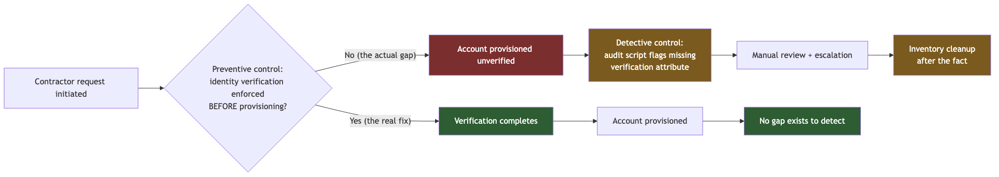
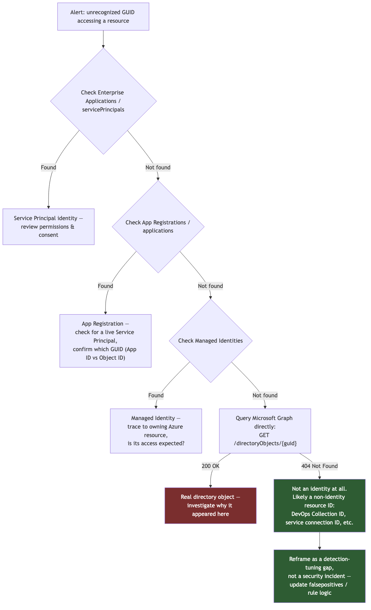

**Part 4: Identity Security Deep Dive**<!--h1-->

Identity is the thread that runs through almost every other part of this lab. The detection rules in `detection-engineering` are mostly sign-in and audit-log rules. The IAM scripts in `intune-endpoint-health-platform` are Microsoft Graph API calls against directory objects. The `aws-identity-detection` repo is entirely about one identity misusing its own permissions. Even the phishing cases in `bec-phishing` are, underneath the email delivery mechanics, an attack on trust in an identity. This part exists to explain identity security properly — not as a glossary of terms, but as the reasoning a working analyst or engineer actually needs, grounded in what this lab's real content does and doesn't cover.

**4.1 Core identity concepts: what an "identity" actually is**<!--h2-->

Before anything else, it's worth being precise about what "identity" means in a security context, because the word gets used loosely and that looseness causes real confusion later — Section 4.3 exists almost entirely because of it.

**An identity is a principal that can be authenticated and then authorized to act.** That's the whole definition. It sounds trivial, but the two halves matter and get conflated constantly:

- **Authentication (AuthN)** answers "who (or what) are you, and can you prove it?" It's the login event — a password check, an MFA challenge, a client certificate, a signed JWT. Authentication produces a *token* or *session*, not permission.
- **Authorization (AuthZ)** answers "now that I know who you are, what are you allowed to do?" It's evaluated separately, every time, against roles, policies, or scopes. A successfully authenticated identity with zero role assignments can do nothing — authentication succeeding says nothing about what happens next.

This separation is the single most important mental model in identity security, because almost every real-world identity incident is a failure in exactly one of these two stages, and the fix is different depending on which one failed. A password-spray attack (see the `password-spray.yml` Sigma rule discussed in Part 5) is an authentication-layer attack — the attacker is trying to *become* an identity. A privilege escalation, like the one the `aws-identity-detection` repo detects (an IAM principal creating a new user and immediately attaching `AdministratorAccess` to it), is an authorization-layer attack — the attacker already *is* an identity, and is manipulating what that identity (or a new one it creates) is allowed to do.

**Identity object types**<!--h3-->

Not every identity is a human. A directory (Entra ID, AWS IAM, or any other identity store) holds several distinct kinds of principal, and detection/response logic has to treat them differently:

- **User** — a human, or a representation of one. Has a password or federated credential, can complete interactive MFA, has a manager, a job title, sign-in activity. This is the identity type `privileged_role_access_review.py` (in `intune-endpoint-health-platform`) is built around — it flags human directory-role members whose `signInActivity.lastSignInDateTime` is more than 30 days stale, because a human who's stopped signing in but still holds a privileged role is a live risk sitting unused.
- **Group** — not itself an identity that authenticates, but a container that grants authorization by membership. Role assignments are very commonly made to groups rather than individual users specifically so that adding/removing a user from a group is the access-control action, not editing role assignments directly. This matters for the JML lifecycle in 4.2 — group membership is usually the actual lever that access reviews and provisioning workflows pull.
- **Service principal (Entra ID) / IAM role or user (AWS)** — a non-human identity representing an application, script, or automated workflow. This is the type the Graph API scripts in this lab authenticate *as themselves being run by* (via device code flow, from a human's session) but is also the type an *app registration* creates when it needs to call an API unattended.
- **Managed identity (Azure-specific)** — a service principal that Azure creates and rotates the credential for automatically, tied to the lifetime of an Azure resource (a VM, a Function App, a Logic App). The entire point of a managed identity is that there is no secret for a human to manage, leak, or forget to rotate — Azure handles the credential material internally. The `sentinel-soar-playbooks` designs (disable-a-compromised-user, isolate-a-device) are written assuming the underlying Logic App would authenticate to Graph API and Defender for Endpoint via a managed identity rather than a stored client secret, precisely to avoid adding a new secret-management burden on top of an incident-response automation.
- **Application / App Registration object (Entra ID)** — the *definition* of an app (its permissions, redirect URIs, certificates), distinct from the service principal that represents an instance of it actually operating inside a specific tenant. This distinction is not academic — it is the exact distinction the GUID triage methodology in 4.3 depends on, because "App Registration exists but no corresponding Service Principal in this tenant" and "Service Principal exists" are two different diagnostic states.

**Entra ID / Azure AD vs AWS IAM: two different vocabularies for the same problem**<!--h3-->

This lab has real content in both worlds — `detection-engineering` and `intune-endpoint-health-platform` are Entra ID-native, `aws-identity-detection` is AWS IAM-native — so it's worth translating between them explicitly rather than assuming one vocabulary transfers cleanly to the other. They solve the same problem (who can do what) with different primitives:

| Concept | Entra ID / Azure AD | AWS IAM |
|---|---|---|
| Human identity | User object | IAM User (increasingly discouraged in favor of federated roles) |
| Non-human identity | Service Principal / Managed Identity | IAM Role (assumed) or IAM User with access keys |
| "What can this identity do" | Role assignment (built-in or custom role) scoped to a resource | IAM Policy (JSON document) attached to a user/group/role |
| Grouping identities | Security Group / Microsoft 365 Group | IAM Group (users only — cannot contain roles) |
| Cross-account/cross-tenant access | Guest user (B2B), cross-tenant access settings | Trust policy on an IAM Role (a JSON document naming which principals may `sts:AssumeRole` into it) |
| Where authorization logic lives | Role assignment + Conditional Access policy, evaluated at sign-in and per-request | IAM Policy evaluated per-API-call, no separate "session risk" layer built in the same way |
| Central authorization query surface | Microsoft Graph API | AWS IAM API / CloudTrail (for what happened) |

The AWS side has one architectural idea that Entra ID doesn't have a direct equivalent for: the **trust policy**. An AWS IAM Role isn't just "a bundle of permissions" — it also carries a document specifying *who is allowed to assume it in the first place* (which accounts, which federated identity providers, under what conditions). This is why the privilege-escalation pattern documented in `aws-identity-detection/detections/privesc-detection.md` is dangerous: `iam:CreateUser` followed immediately by `iam:AttachUserPolicy` with `AdministratorAccess` doesn't need a trust policy at all, because the attacker is creating a brand-new identity and directly attaching permissions to it — no assumption step, no trust boundary to cross. That's exactly why this is one of the best-documented cloud privilege-escalation primitives (catalogued by tools like Rhino Security Labs' `pmapper`): it skips the one control (trust policy review) that AWS's role-assumption model would otherwise force an attacker through.

Entra ID's rough analog to a trust policy is Conditional Access plus cross-tenant access settings (covered in 4.4) — but it's evaluated at a different layer (sign-in time, continuously, with real-time signals like device compliance and location) rather than being a static document attached to the identity itself. Neither model is "better" in the abstract; they reflect the different shapes of the two clouds' control planes.

**4.2 The Joiner-Mover-Leaver (JML) lifecycle**<!--h2-->

**Joiner-Mover-Leaver** is the standard identity governance framework for the three moments in an identity's life where access should change:

- **Joiner** — a new identity is provisioned. Access should be granted based on role, not copied from a convenient existing account ("just give them what Sarah has").
- **Mover** — an existing identity changes role, team, or department. Access should be re-evaluated — old access removed, new access granted — not simply additive. This is the stage most JML programs handle worst in practice, because "add access when someone moves" is an obvious ticket to file, and "remove the access they no longer need" is not, so it quietly doesn't happen.
- **Leaver** — an identity's relationship with the organization ends. Access should be revoked, ideally immediately and completely, not left to expire on its own or get caught later in an audit.

JML matters as a foundational concept because it's the framework that turns "identity security" from a point-in-time login problem into a lifecycle problem. Almost every stale-access finding an auditor produces — orphaned accounts, over-privileged movers, leavers who still have a valid session token three weeks after their last day — is a JML process gap, not a technology failure. The technology (Entra ID, IAM) will happily do exactly what it's told; JML is about whether what it's told is still correct.

**A real failure mode from this lab: unverified contractor provisioning**<!--h3-->

The `intune-endpoint-health-platform` work includes a documented real process-gap pattern from the Joiner stage specifically: contractor accounts were being provisioned without an enforced identity-verification step first. In other words, the provisioning process had a step that was *supposed* to happen (verify who this contractor actually is before an account exists for them) but nothing in the technical process actually required it — it depended on a human doing it correctly, every time, without the system checking. This is a textbook Joiner-stage gap: the failure isn't in a login flow or a permission boundary, it's upstream of both, in the moment an identity is created in the first place.

This got caught, escalated, and led to an inventory cleanup — which is the useful part to actually learn from, because the *shape* of the fix matters more than the specific incident.

**Detective vs preventive controls, and why this distinction is the whole lesson**<!--h3-->

The way this gap was caught was an **audit script that flagged accounts missing verification attributes** — after the fact, on a schedule, looking at what already existed. That is a **detective control**: it finds problems that have already happened. It's valuable — genuinely, an audit script that surfaces "these N contractor accounts have no recorded identity-verification step" is far better than not knowing — but it is not the same thing as fixing the problem, and it's important to be precise about why.

A detective control tells you a gate was skipped *after* someone has already walked through the gap. Every account it finds already existed, with real access, for however long it took the audit to run and someone to review the output. If that access happened to be sensitive, the exposure window is real and already happened by the time detection fires. This is why a detective-only response to a Joiner-stage gap is properly called a **compensating control**, not a fix: it compensates for the missing preventive control by catching its output, but it does nothing to stop the next instance of the same gap from occurring, and it depends on someone actually reviewing and acting on the audit output every time it runs.

A **preventive control** stops the gap from being creatable in the first place — in this case, that would mean the provisioning workflow itself refusing to create an enabled account (or refusing to activate/enable an already-created one) until the verification attribute is actually populated. Preventively, "contractor account exists" and "contractor identity has been verified" become the same fact, enforced at creation time, not two facts that a script has to reconcile later.

The reason this distinction is worth teaching carefully, not just naming: a detective control is usually *faster and cheaper to build* than a preventive one — an audit script that runs a Graph query and flags missing attributes (structurally similar to `orphaned_account_detection.py` in this same repo, which flags enabled accounts with no manager assigned by walking `/users` and checking `/users/{id}/manager` for a 404) can be written in an afternoon. Rebuilding a provisioning workflow so it structurally cannot create an unverified account is a real engineering and process change, often touching whatever system originates the Joiner event (HR system, ticketing system, or a manual request form) — and that's exactly why organizations under time pressure land on the detective control and stop there, and why "we have a script that catches this" quietly becomes the permanent answer instead of the interim one. Recognizing that pattern — and pushing past it — is a real, teachable piece of identity governance judgment, not a theoretical nuance.



**JML and Mover/Leaver in this lab's other content**<!--h3-->

The Leaver stage is the direct motivation for `orphaned_account_detection.py`: an enabled account with no manager assigned is exactly the kind of account a Leaver process should have caught and disabled, but didn't — nobody owns it, which in practice means nobody notices it going stale, being targeted, or quietly retaining access it no longer needs. The script's own output deliberately caveats this ("no manager isn't proof of orphaning on its own — service accounts and some external guests legitimately have none") which is itself good JML practice: a detective control's output is a worklist for a human to triage, not an automatic verdict.

The Mover stage doesn't have dedicated tooling in this lab yet, but it's the same underlying pattern as `privileged_role_access_review.py`: a Mover who changed teams six months ago and never had their old privileged role assignment removed looks, from Graph's perspective, identical to a Joiner who was over-provisioned from day one — a directory role member whose actual current job doesn't justify the access. The access-review script catches both by asking the same question (stale sign-in activity on a privileged role member) regardless of which JML stage produced the mismatch.

**4.3 GUID/Object triage methodology**<!--h2-->

This is one of the most concrete, real pieces of investigative methodology in this whole lab, and it's worth explaining *why* the problem exists architecturally before walking through the runbook itself — the "why" is what makes the methodology make sense instead of feeling like an arbitrary checklist.

**Why this ambiguity exists**<!--h3-->

In Azure and Entra ID, GUIDs (128-bit UUIDs, formatted like `3b8e4a2f-6c1d-4a9e-8b2a-1d2e3f4a5b6c`) are the universal identifier format — and they are used for *both* identity objects and non-identity resource references, with **no type information encoded in the GUID itself**. A GUID that identifies a user object, a GUID that identifies an App Registration, a GUID that identifies an Azure DevOps Collection, and a GUID that identifies a service connection inside a DevOps project are all, structurally, the exact same kind of value — 32 hex characters in the same five-group pattern. There is nothing about the string `3b8e4a2f-6c1d-4a9e-8b2a-1d2e3f4a5b6c` itself that tells you which of those it is. The only way to know is to ask the system that's supposed to know it — and different systems own different GUID namespaces, so you may have to ask more than one.

This is why a detection that fires on "unrecognized GUID accessing a resource" is, on its own, an *incomplete* alert — it correctly flags that a GUID has been seen that isn't in your known-identity inventory, but "not in your known-identity inventory" has at least two very different explanations: (a) this really is an unrecognized identity — a real security concern — or (b) this is a legitimate non-identity resource reference (a DevOps Collection ID, a service connection ID, an application's internal resource GUID) that was never going to appear in an identity inventory in the first place, because it was never an identity. Triage exists to tell those two apart, and doing it wrong in either direction has a real cost: false-negative (waving off a real unrecognized identity as "probably just a resource ID") is a missed intrusion; false-positive (escalating a routine DevOps service connection as an unknown identity) is wasted analyst time and, at scale, alert fatigue that erodes trust in the detection.

**The real investigative methodology**<!--h3-->

The `guid-triage` runbook in `detection-engineering` documents the actual sequence an analyst works through to resolve this ambiguity, roughly in order of "cheapest and most likely to resolve it" to "authoritative":

1. **Check Enterprise Applications** (Entra ID admin center, or `GET /servicePrincipals/{id}` via Graph). Enterprise Applications is the tenant's list of service principals — instances of applications (first-party, third-party, or your own) that have actually been consented to and can operate in this tenant. If the GUID resolves here, it's a service principal — a real, non-human identity, and worth understanding what permissions it holds and who consented to it.
2. **Check App Registrations** (`GET /applications/{id}` via Graph). This is the *definition* layer, distinct from Enterprise Applications/service principals as discussed in 4.1 — an app can be registered (defined) in a tenant without necessarily having an active service principal doing something right now, or the GUID in the alert might be the Application (client) ID rather than the Object ID, which is a common source of confusion since both are GUIDs and both are shown in different places in the Entra portal for the same app.
3. **Check Managed Identities** (filtered view within Enterprise Applications, or `GET /servicePrincipals?$filter=servicePrincipalType eq 'ManagedIdentity'`). If the GUID belongs to a managed identity, it should trace back to a specific Azure resource (a VM, Function App, Logic App) — and if it does, the next question is simply whether that resource's automation is supposed to be touching the thing it touched, which is a much more mundane investigation than "unknown identity."
4. **Query Microsoft Graph API directly for the object**, e.g. `GET https://graph.microsoft.com/v1.0/directoryObjects/{guid}`. This is the step that actually resolves the ambiguity authoritatively, because the *response code itself is the signal*, not just the payload:
   - **200 OK with a directory object body** → this GUID identifies a real object in the directory (user, group, service principal, application) that Graph knows about. Now the question shifts to "why did this specific object legitimately show up here, and is that expected."
   - **404 Not Found** → Graph, which is the authoritative source for every identity object in the tenant, has no record of this GUID as a directory object *at all*. This is the concrete, decisive evidence that the GUID is very likely a non-identity resource reference — an Azure DevOps Collection ID, a service connection ID, an internal resource identifier from some other Azure or third-party service that happens to use GUIDs for its own object naming, none of which live in the Entra ID directory Graph queries against.

A 404 here isn't "inconclusive" — it's the actual finding. It means: whatever this GUID is, it is *not* an identity, because if it were, the tenant's own identity directory would know about it. That reframes the original alert from "unrecognized identity accessing a resource" to "a non-identity resource ID got picked up by log parsing/correlation logic that assumed every GUID in that log field was an identity" — which is a detection-tuning problem (see the `falsepositives` discussion in Part 5.4), not a security incident.



**Why this matters beyond one runbook**<!--h3-->

The deeper lesson is that **identity detection logic is only as good as its assumption that a GUID in a given log field is actually an identity** — and that assumption is often built into a query or correlation rule without anyone explicitly stating it, because in the common case it's true. Azure's architecture doesn't give you a free type check on a GUID; you have to build one, either into the detection itself (pre-filtering known non-identity GUID namespaces, where that's feasible) or into the triage process that handles what the detection produces. This runbook is the second approach, done properly: cheap checks first, an authoritative check (Graph's 200/404) as the tiebreaker, and the result of that tiebreaker treated as real evidence, not a shrug.

**4.4 Conditional Access, MFA, and PIM**<!--h2-->

These three controls are often talked about together because they all sit at the boundary between "an identity is authenticated" and "an identity gets to use a privilege," but they answer different questions.

**Multi-Factor Authentication (MFA)** answers "is this really the person the password claims it is?" by requiring a second, independent proof of identity (a push approval, a TOTP code, a hardware key) in addition to something known (the password). MFA is the single highest-leverage control against credential-based attacks generally, including the password-spray pattern this lab's `password-spray.yml` Sigma rule detects — a spray attack that successfully guesses a password still fails at the MFA challenge, so the practical damage of the underlying weak/reused password is contained by a control at a completely different layer. This is why MFA fatigue attacks (an attacker who already has valid credentials spamming MFA push approvals hoping for an accidental tap) exist as a distinct attack pattern worth its own playbook — it's specifically targeting the one control standing between a stolen credential and account takeover. This lab now has exactly that: a full worked case study (detection through lessons learned) in `detection-engineering/identity-incident-response/`, covering both MFA fatigue/push-bombing and impossible travel — see 4.8 below.

**Conditional Access (Entra ID)** is policy evaluated at sign-in time (and, with continuous access evaluation, in near-real-time during a session) that decides whether to grant, block, or add friction to an access attempt based on signals: which user, which app, from what location/IP, from what device (and is that device compliant/managed), what the calculated sign-in risk level is. It's the practical mechanism for "just because you authenticated correctly doesn't mean this specific access attempt, in this specific context, should be allowed" — e.g. requiring MFA specifically when sign-in risk is elevated rather than every time, or blocking sign-in entirely from locations the organization has no legitimate presence in. The `sentinel-soar-playbooks` designs assume Conditional Access policies exist as the thing that got tampered with in the `conditional-access-policy-tampering.yml` Sigma rule's scenario — a Conditional Access policy being weakened or disabled is itself a high-value target for an attacker who already has some foothold, because it removes a standing control rather than working around it once.

**Privileged Identity Management (PIM)** is the mechanism for **just-in-time (JIT) privileged access** instead of **standing privileged access**. Without PIM, being a Global Administrator means holding that role permanently — the permission exists on the account 24/7, whether or not anyone is using it in a given moment, which means the account is a maximally attractive target every single moment of every day, and any successful compromise of it is instantly a full-privilege compromise. With PIM, a user is *eligible* for the Global Administrator role but doesn't hold it by default; they *activate* it for a limited time window (commonly requiring MFA re-confirmation and/or a business justification, sometimes requiring another admin's approval), use the privilege for what they needed it for, and it expires back to nothing automatically.

The reason PIM matters as a real control, not a compliance checkbox, is the attack-surface math: a compromised credential for a PIM-eligible-but-not-activated account gets an attacker nothing privileged — they'd additionally have to trigger and survive an activation flow (MFA, approval, justification, all of which can be logged and alerted on) to actually get the privilege. `privileged_role_access_review.py` in this lab is directly downstream of this idea, even without PIM configured: it flags directory-role members who haven't signed in for 30+ days, because a standing privileged role assignment on an account nobody is actively using is exactly the risk profile PIM is designed to eliminate — the role is a liability sitting there with nothing to show for it. The honest state of this lab, per its own README, is that the PIM walkthrough itself is one of the not-yet-done items in the IAM catalog — it needs a real Entra ID P2-licensed tenant (available via the free M365 Developer Program E5 trial) that hasn't been set up yet, so PIM here is explained as the correct control to reach for, not demonstrated end-to-end.

**4.5 RBAC and least privilege**<!--h2-->

**Role-Based Access Control (RBAC)** means authorization decisions are made by assigning identities (or groups) to *roles* — named bundles of permissions — rather than granting individual permissions directly to individual identities one at a time. The value is manageability: reviewing "who has the Contributor role" is tractable; reviewing "what is the union of every individually-granted permission across every identity" is not, at any real scale.

**Least privilege** is the principle that an identity should hold only the permissions it actually needs to do its job, no more — and RBAC is the mechanism most identity systems use to try to approximate that in practice, imperfectly, because roles are necessarily coarser than any one person's actual job.

**Role assignment scope in Azure**<!--h3-->

A critical, easy-to-get-wrong detail in Azure RBAC is that a role assignment isn't just "this role" — it's "this role, at this scope," and Azure's scopes nest hierarchically:

```
Tenant (Entra ID directory root — Entra roles, not Azure RBAC)
  └── Management Group
        └── Subscription
              └── Resource Group
                    └── Resource (a single VM, storage account, etc.)
```

A role assigned at a higher scope is inherited by everything beneath it. Assigning `Contributor` at the *subscription* level grants Contributor on every resource group and every resource inside that subscription — including resource groups and resources that get created *after* the assignment was made, with no additional action needed. This inheritance is powerful and exactly why over-broad scoping is one of the most common real over-privileging failure modes: an assignment made at subscription scope because it was the fastest way to unblock someone (or because the resource group they actually needed access to didn't exist yet) quietly grants access to everything that gets built in that subscription going forward, and nobody circles back to narrow it once the resource group in question does exist.

The `terraform-labs` repo's own operational discipline is a direct, if implicit, RBAC-scope-adjacent lesson: its README documents authenticating via `az login` rather than long-lived secrets, and running `terraform destroy` after every exercise — both of which are about minimizing the *time window and blast radius* that any credential or resource footprint exists for, which is the same underlying instinct as scoping a role assignment as narrowly as workable rather than as broadly as convenient.

**Common over-privileging failure modes**<!--h3-->

- **Scope creep by convenience** — assigning at subscription or resource-group scope because it's one fewer decision than assigning at the individual resource, even when the actual need is one resource.
- **Role creep over time** — an identity accumulates role assignments across multiple projects/teams as it moves through an organization (the Mover problem from 4.2) and nothing is ever removed, only added.
- **Built-in roles that are broader than the job** — `Contributor` grants nearly everything except access-management actions; it's often assigned because it "obviously covers what's needed" without checking whether a much narrower built-in or custom role would have covered the actual task.
- **Standing privileged roles instead of PIM-eligible ones** (4.4) — RBAC and PIM are complementary, not competing: RBAC defines *what* a role can do, PIM (where configured) governs *when* an identity actually holds it.
- **Group-based assignment drift** — a role assigned to a group is only as tightly scoped as that group's membership is actively curated; a stale group with broad role assignment is a single point where JML failures (4.2) and RBAC failures compound each other.

**4.6 Federation and identity providers (IdP)**<!--h2-->

An **Identity Provider (IdP)** is the system that authenticates a user and asserts their identity to other applications, so that individual applications don't each have to build and secure their own password store. **Federation** is the practice of trusting an external IdP's assertion rather than maintaining a separate identity for the same person in every system — sign in once to the IdP, and downstream applications trust that session.

Two protocols dominate how that trust assertion is actually carried:

- **SAML (Security Assertion Markup Language)** — an older, XML-based standard where the IdP issues a signed XML assertion ("this browser session belongs to user X, authenticated at time T, with these attributes") that the Service Provider (the application) validates and trusts. Very common in enterprise SSO, especially with legacy or on-prem-adjacent applications.
- **OIDC (OpenID Connect)** — built as a thin identity layer on top of OAuth 2.0, using JSON and JWTs (JSON Web Tokens) instead of XML. The IdP issues an ID token (a signed JWT asserting who the user is) alongside the OAuth access token that's actually used for API authorization. OIDC is the more modern default for web and mobile applications, and is what most consumer-facing "Sign in with X" flows use under the hood.

Neither protocol is intrinsically "more secure" — both, done correctly (validated signatures, checked audiences/issuers, short-lived tokens), provide a solid trust boundary; both, done incorrectly (accepting unsigned assertions, not validating the audience claim), are trivially bypassable. The practical difference is more about ecosystem fit: SAML shows up more in enterprise/legacy SSO integrations, OIDC in modern API-driven and mobile-first architectures.

**Entra ID as an IdP, and Auth0 as a real, working second one**<!--h3-->

This lab's identity content — the Sigma rules, the Graph API scripts, the Conditional Access/PIM discussion above — is almost entirely Entra ID-native, for the practical reason that Entra ID is the IdP this lab actually has meaningful, if incomplete, access to (via the free M365 Developer Program path referenced in `intune-endpoint-health-platform`'s README).

**Auth0** **[FREEMIUM]** (Okta-owned; the tier actually in use here is a free trial, time-boxed on a countdown rather than an indefinite free allowance) is now a real, working second identity provider for this lab — a genuine change from this document's earlier state, where Auth0 was an unfinished plan. A real Machine-to-Machine application was created and authorized against Auth0's own Management API, giving this lab a real Domain, Client ID, and Client Secret, and `poll_auth0_logs.py` checkpoint-polls Auth0's **System Log** — its own event stream of logins, failures, blocked accounts, and Management API/M2M activity — into Wazuh via custom rules (Part 3.7 covers the full integration). That System Log has a genuinely different shape from Entra ID's `SigninLogs`/`AuditLogs`, which is exactly the value it adds: a second data source with its own schema, rather than every rule in this lab being written against the same one.

Getting there also surfaced a real least-privilege lesson worth restating here in identity terms: the M2M application's client-grant came back from Auth0's own authorize flow with nearly the entire Management API scope — user management, client management, encryption keys, effectively everything — instead of just the two read-only log scopes actually needed, because the dashboard's "Authorize" step defaults to showing every available scope checked unless someone actively narrows it. This is the same over-permissioning failure mode discussed elsewhere in this part (4.5's RBAC scope-creep discussion) playing out in a different IAM system entirely: a tool's own default behavior handing out more access than was requested, silently, unless a human deliberately corrects it. The fix — narrowing the grant's `scope` via the Management API and then verifying a write call now correctly fails with `403 insufficient_scope` — is covered in full in Part 3.7 and Part 10.

**4.7 BEC and phishing as identity-adjacent threats**<!--h2-->

Business Email Compromise (BEC) and phishing are usually filed under "email security," but they belong in an identity security discussion because of what they're actually attacking: **not a login flow, but trust in an identity itself** — specifically, a recipient's trust that a message genuinely came from the sender it claims to. That's identity spoofing/impersonation, functionally the same underlying problem as a stolen credential, just executed without ever touching the target's authentication system at all. This lab's `bec-phishing` folder (in `detection-engineering`) documents two real cases that illustrate two distinct ways that trust gets forged.

**Case 1: invoice fraud via authenticated bulk-mail services**<!--h3-->

The first case is invoice fraud delivered through legitimate, authenticated bulk-mail services — services like SendGrid or Mailchimp. The mechanism worth understanding closely: these services maintain their *own* sender reputation, built from the aggregate behavior of every legitimate customer sending through their infrastructure, and their outbound mail correctly passes SPF and DKIM for *their own* sending domain (because it genuinely originates from their infrastructure, with their own authentication configured correctly — nothing about the transport is forged). An attacker who signs up for one of these services and sends a fraudulent invoice through it inherits that platform's good reputation and correctly-passing authentication, which is exactly what lets the message bypass reputation-based and basic authentication-based filtering that would otherwise catch a more obviously spoofed message. The fraud isn't in the transport layer at all — SPF/DKIM genuinely pass, because the mail genuinely came from SendGrid/Mailchimp's servers, exactly as configured. The fraud is entirely in the *content*: an invoice with altered payment details, sent to look like it came from a known vendor, riding on infrastructure that authentication checks were never going to catch because those checks were never lying about where the mail came from.

**Case 2: executive impersonation via external personal email**<!--h3-->

The second case is executive impersonation from an external personal email address, where the SPF/DKIM/DMARC picture is the opposite of case 1: **misalignment**, not clean pass. This is the more classically recognizable BEC pattern — an email claiming to be from a company executive, sent from a lookalike or unrelated external address, asking for an urgent wire transfer or gift-card purchase, exploiting organizational trust in a name and title rather than any technical trust mechanism. Here, DMARC alignment checks (does the visible From: domain match what SPF/DKIM actually authenticated?) are the relevant control — a message claiming to be from `ceo@company.com` but actually sent from an unrelated personal domain fails alignment, and a DMARC policy set to reject or quarantine (rather than just monitor) on failure is the concrete technical control that stops this specific pattern, if the organization's DMARC policy is actually enforced rather than left at `p=none`.

**Why these are identity security problems, not just email problems**<!--h3-->

The reason both cases belong in an identity security discussion, not a separate "email security" bucket, is the throughline from 4.1: **authentication is "who are you, and can you prove it," and both of these attacks are entirely about defeating that question for a human reader instead of for a login system.** Case 1 defeats it by riding on infrastructure whose technical authentication is genuinely valid, while the represented identity (the vendor) is not who actually sent the content. Case 2 defeats it by impersonating a name and title the recipient trusts, from an address that fails the technical authentication check that exists specifically to catch that. Neither attacker needed a password, a token, or an MFA bypass — they needed the recipient to *believe* an identity claim, which is the exact same target as a credential-stealing phish, reached by a different route. Framed against 4.1's authentication/authorization split, both cases are pure authentication-layer attacks aimed at a human verifier instead of a machine one — which is precisely why technical controls alone (SPF/DKIM/DMARC enforcement) address case 2 but only partially blunt case 1, and why case 1 ultimately still needs human judgment or content-based detection, not just sender authentication, to catch.

**4.8 Two real identity incident-response case studies**<!--h2-->

Everything in 4.4 and 4.7 above is theory and design — the correct controls, the correct detection logic, the correct triage reasoning. `detection-engineering/identity-incident-response/` (a new folder) turns two of those threats into full, worked lifecycle case studies — detection through lessons learned, not just a rule sitting on its own — and both are grounded in a fictional Contoso scenario (`j.reyes@contoso.com`), the same honest synthetic-data discipline used throughout this lab's other detection content.

**MFA fatigue / push-bombing.** A brand new Sigma rule, `mfa-fatigue-detection.yml` (tagged `T1621` and `T1110`), backs the case study referenced above in 4.4. It has the same real limitation as this lab's `password-spray.yml` rule: Sigma's own syntax can't natively express the aggregation logic ("N MFA push denials/approvals from the same user within a short window") this detection actually needs, so the aggregation is hand-written directly into the generated KQL, with a comment in the rule explaining why the aggregation couldn't be expressed in Sigma itself. The case study around it — incident report, playbook, and hunting query — walks the full lifecycle a real push-bombing incident would generate.

**Impossible travel.** This case study builds the missing lifecycle artifacts (incident report, playbook, hunting query) on top of a Sigma rule that already existed in this repo, `sigma-rules/impossible-travel.yml`, rather than duplicating detection logic that was already there. The hunting query is deliberately a genuinely complementary detection angle, not a restatement of the same signal: it does its own independent geo-velocity math (distance between two sign-in locations divided by the time between them, compared against a physically-plausible travel speed) rather than relying on Entra ID's own `RiskEventTypes` field — a second, independently-reasoned way of catching the same underlying threat, useful specifically because it doesn't fail the exact way the built-in signal would if that signal were ever tuned out, disabled, or simply wrong.

Both playbooks are explicit, in the same honest register as `sentinel-soar-playbooks` elsewhere in this lab, that they are **designs**, not deployed automations — a documented, reasoned response workflow, not a script that actually executes anything. Part 6.2 references these same two case studies as real, worked triage examples.
