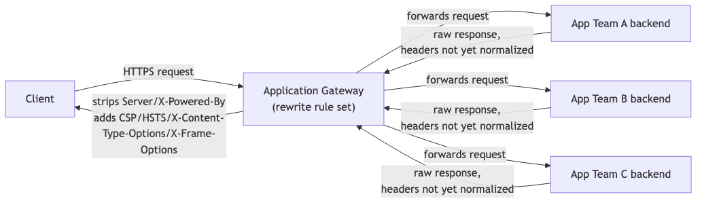
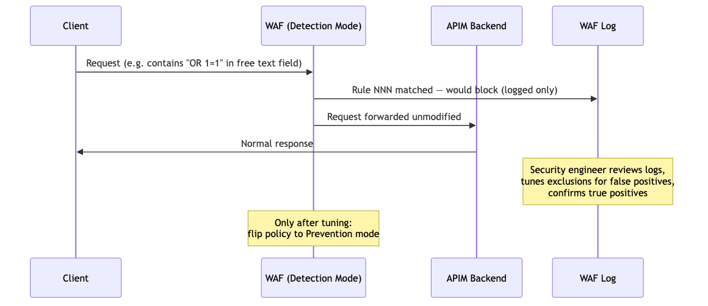

**Part 8: Cloud Security & Infrastructure as Code**<!--h1-->

This part covers the `terraform-labs` and `aws-identity-detection` repos —
the cloud/IaC-facing half of this lab. Two facts matter for reading this
part honestly: none of the `terraform-labs` exercises have ever been
`apply`'d against a real Azure subscription (they are `terraform fmt`/
`validate` clean and honestly documented as untested-in-anger), and the
AWS side is deliberately tested against a local emulator, not a real AWS
account. That is not a weakness to apologize for — it is itself a security
decision, and this part explains why.

**8.1 Terraform + Azure: security principles beyond "how IaC works"**<!--h2-->

Terraform **[FREE]** (the open-source CLI, Mozilla Public License 2.0) is
used here as the IaC tool of record. It is worth separating two things
that get conflated: Terraform-the-CLI, which is free and self-contained,
and Terraform Cloud, which is a hosted service with its own free and paid
tiers (covered in Part 12). The `terraform-labs` repo's exercise 04 is
specifically a Terraform Cloud integration exercise, but the CLI itself —
what actually runs `plan`/`apply`/`destroy` — costs nothing.

**Secrets hygiene in IaC: why `.tfstate` and `.tfvars` must never be committed**<!--h3-->

Two files are the recurring landmines in any Terraform repo, and both are
landmines for the same underlying reason: Terraform's whole job is to
describe and track real infrastructure, and real infrastructure has real
identifiers, real network ranges, and sometimes real credentials baked
into the description of what should exist.

- **`.tfstate`** (and `.tfstate.backup`) is Terraform's record of every
  resource it created and every attribute of that resource as last known
  — resource IDs, computed values, and in many providers' schemas, secret
  values that were set as resource arguments (a generated database
  password, a storage account key, a connection string) get written into
  state **in plaintext** by default, because state is what lets Terraform
  compute a diff on the next `plan`. A `.tfstate` file is not "metadata
  about infrastructure" in the way a Kubernetes manifest is — it is
  frequently a de facto credentials dump. Committing it to a public repo
  is equivalent to publishing whatever secrets happened to exist in any
  resource Terraform managed, at any point in the project's history (git
  history matters here too — deleting the file in a later commit does not
  remove it from history).
- **`.tfvars`** files (`terraform.tfvars`, `*.auto.tfvars`) are where a
  user supplies input values to a module — and it is extremely common,
  especially early in learning Terraform, to put a real subscription ID,
  a real admin password variable, or a real API key directly into one of
  these files because it is the path of least resistance to "just get it
  running." The fix is not "be careful" — the fix is that `.tfstate` and
  any `*.tfvars` file with real values in it belong in `.gitignore` from
  the very first commit of a Terraform repo, before a single `apply` is
  ever run, and example/template variants (`terraform.tfvars.example`)
  with placeholder values are what actually gets committed for other
  readers.

**When to use this / when NOT to use this**: the "never commit state or
tfvars" rule is universal for any repo that is or might become public. It
is slightly relaxable only in a fully private repo with restricted access
and a remote backend already handling state (see exercise 02, the remote
state Azure backend) — but even then, defaulting to "gitignore it anyway"
costs nothing and removes an entire class of future accidents if the repo
visibility ever changes.

**gitleaks as a second-layer safety net — and its real, documented limitation**<!--h3-->

`gitleaks` **[FREE]** (open source, Apache 2.0) is a secret-scanning tool
that greps commits (and optionally full history) for patterns that look
like credentials — AWS access keys, private key headers, high-entropy
strings adjacent to variable names like `password` or `secret`. It was
run as part of this lab's confidentiality audit process (see Part 10) and
is genuinely useful as a second layer of defense.

The honest limitation, documented in this lab's `terraform-labs` README:
during testing, a password string containing a `$` character slipped
past gitleaks undetected. Shell and Terraform interpolation syntax both
use `$` heavily (`${var.name}`, `$VARIABLE`), which means pattern- and
entropy-based scanners tuned to avoid flagging every interpolation
expression in a codebase can end up under-flagging a real secret that
happens to contain the same character. The lesson that matters here is
specific and important: **"the hook didn't complain" is not proof a
commit is clean.** A `.gitignore` that never lets the sensitive file
reach `git add` in the first place is the actual control; gitleaks (or
any secret scanner, pre-commit hook, or CI gate) is a backstop that
catches mistakes the primary control missed — not a substitute for the
primary control, and not something to trust blindly because it stayed
silent.

**When to use this / when NOT to use this**: run gitleaks (or an
equivalent scanner) on every repo before making it public, and ideally as
a pre-commit hook so it never gets forgotten under deadline pressure. Do
not treat a clean gitleaks run as a substitute for manually confirming
`.tfstate`/`.tfvars`/`.env` files were never staged, and do not treat it
as a substitute for a full-history audit before a repo's first public
push (see Part 10's confidentiality audit case study) — a scanner
tuned for common secret shapes will always have blind spots for the
shapes it wasn't tuned for.

**Least-privilege auth for IaC: `az login` vs. long-lived service principal secrets**<!--h3-->

Terraform needs to authenticate to Azure to do anything. There are two
common ways to give it credentials, and they carry very different risk
profiles:

- **`az login`** (interactive, browser-based, uses the Azure CLI's own
  token cache) authenticates as the actual logged-in human, using
  short-lived OAuth tokens that expire and require re-authentication —
  and critically, whatever MFA policy is on that account applies to this
  login too.
- **A service principal with a long-lived client secret** is a
  non-interactive credential (a client ID + client secret pair) meant for
  unattended/CI use. It works from any machine that has the secret,
  indefinitely, until manually rotated or expired — which is exactly what
  makes it dangerous if it leaks: unlike an interactive session, there is
  no human-in-the-loop MFA check standing between "someone has this
  string" and "someone can create/destroy real Azure resources."

This lab's `terraform-labs` README states the deliberate choice: **auth
only via `az login`, never long-lived secrets**, precisely because a
single human doing exploratory, non-automated learning work has no real
need for an unattended credential, and every unattended credential that
exists is one more thing that can leak. A service principal with a
scoped-down role and a short secret rotation window is the right answer
for genuine CI/CD automation; it is the wrong answer for "I want to run
`terraform apply` from my laptop while I'm sitting at it."

The other concrete guardrail documented in the same README: **a spending
cap is set on the Azure subscription before creating anything**, and
**MFA is required** on the account doing the `az login`. Neither of these
is IaC-specific — they are account-level controls — but they matter
specifically *because* IaC can create billable resources faster than a
human reviewing a portal UI would, and a misconfigured `for_each` loop or
an accidentally-`apply`'d module can create far more resources, far
faster, than manual clicking ever would. A spending cap turns "I made an
expensive mistake" into "I made a mistake that got capped," which is the
entire point of setting it *before* the first resource exists, not after
a surprise bill.

**When to use this / when NOT to use this**: use `az login` for any
individual, interactive, exploratory Terraform work — which is all this
lab's Terraform work is, since nothing has been `apply`'d yet. Use a
service principal only when there is a genuine unattended automation
need (a CI pipeline running `terraform plan`/`apply` on merge, for
example) — and even then, scope its role assignment as narrowly as the
pipeline's actual job requires, not `Owner` on the subscription out of
convenience.

**8.2 Case study: security-header baseline at the Application Gateway**<!--h2-->

`terraform-labs` exercise 06 defines Application Gateway **[PAID]** (Azure
Application Gateway is a billed, consumption-plus-instance-priced Azure
resource — there is no free tier; it is included here as IaC design, not
as something that has been deployed) rewrite rules that add a baseline
set of security response headers — `Content-Security-Policy`,
`Strict-Transport-Security`, `X-Content-Type-Options`,
`X-Frame-Options` — and that **strip** version-disclosure headers like
`Server` and `X-Powered-By` before a response leaves the gateway.

```hcl
# Illustrative shape of the exercise 06 rewrite rule set — generic
# example, not verified output, since nothing here has been apply'd.
resource "azurerm_application_gateway" "main" {
  # ... gateway core config ...

  rewrite_rule_set {
    name = "security-header-baseline"

    rewrite_rule {
      name          = "add-security-headers"
      rule_sequence = 100

      response_header_configuration {
        header_name  = "Strict-Transport-Security"
        header_value = "max-age=31536000; includeSubDomains"
      }
      response_header_configuration {
        header_name  = "X-Content-Type-Options"
        header_value = "nosniff"
      }
      response_header_configuration {
        header_name  = "X-Frame-Options"
        header_value = "DENY"
      }
      response_header_configuration {
        header_name  = "Content-Security-Policy"
        header_value = "default-src 'self'"
      }
    }

    rewrite_rule {
      name          = "strip-version-disclosure-headers"
      rule_sequence = 110

      response_header_configuration {
        header_name = "Server"
      }
      response_header_configuration {
        header_name = "X-Powered-By"
      }
    }
  }
}
```

**The principle: centralize the control at a chokepoint**<!--h3-->

The reason this exercise exists is not "how do you set an HTTP header in
Terraform" — it is a specific architectural argument for **where** a
security control should live. If every application team behind the
gateway is individually responsible for configuring their own app's
security response headers correctly, the realistic outcome across a
portfolio of a dozen apps is a dozen slightly different, mostly-forgotten
header configurations — some teams get it right, some ship the framework
default (which often actively leaks version information, e.g. an
unmodified `Server: nginx/1.18.0` or `X-Powered-By: Express`), and none of
it is enforced anywhere.

Putting the rewrite at the Application Gateway — the single chokepoint
every request and response already has to pass through — turns "twelve
teams each configuring headers correctly" into "one gateway config,
correct once, applying to everything behind it." This is the same logic
behind putting a WAF at a gateway rather than asking every app to
implement its own input validation for every known attack pattern: a
shared enforcement point scales better than distributed, per-team
discipline, because it does not depend on every team remembering to do
the right thing every time a new service is deployed.



**The honest limitation**<!--h3-->

A gateway rewrite rule normalizes what *leaves* the gateway. It cannot
verify two things that actually matter for whether the control is doing
its job:

1. **Whether the CSP value is actually a good policy for the app behind
   it.** `default-src 'self'` is a reasonable generic baseline, but a
   real app might legitimately need to load fonts from a CDN, submit
   forms to a third-party payment processor, or embed a widget — none of
   which a blanket gateway-level CSP can know about. Setting the header
   is not the same as setting the *right* header for every app behind the
   gateway; it is a floor, not a tailored policy per app.
2. **Whether the app has inline scripts that will break under it.** A
   strict CSP without `'unsafe-inline'` or a nonce/hash mechanism will
   silently break any app that relies on inline `<script>` tags or
   inline event handlers (`onclick="..."`) — which is common in older or
   less disciplined frontend code. The gateway has no way to know this in
   advance; the failure mode shows up as "the app stopped working" in a
   browser console, not as a Terraform error, and it shows up *after*
   the rewrite rule is live, not before.

The realistic operating model this implies: a gateway-level header
baseline is a good default floor, not a "set it and forget it" control.
It still needs per-app validation (does this app actually work under this
CSP?) and the CSP value itself still needs tuning per application over
time — the gateway just makes sure *something* reasonable is applied
everywhere by default, instead of nothing being applied anywhere until an
app team gets around to it.

**8.3 Case study: WAF-in-front-of-APIM, detection mode pilot**<!--h2-->

`terraform-labs` exercise 07 puts an Azure Web Application Firewall
**[PAID]** (bundled with Application Gateway's WAF SKU or as a policy
attached to Front Door — billed, no free tier) in front of Azure API
Management (APIM) **[PAID]**, configured in **detection mode** rather
than prevention mode.

**Detection mode vs. prevention mode**<!--h3-->

A WAF evaluates every request against a ruleset (commonly the OWASP Core
Rule Set) looking for patterns associated with SQL injection, XSS, path
traversal, and similar attack classes. It has two fundamentally different
operating modes:

- **Prevention mode**: a request that matches a blocking rule is
  actually blocked — the client gets a 403 (or similar), the request
  never reaches the backend.
- **Detection mode**: a request that matches a blocking rule is **logged
  as if it would have been blocked**, but is allowed through to the
  backend unmodified. Nothing about the live traffic changes; the only
  output is a log entry saying "this rule would have fired here."

**Why this staged-rollout pattern matters**<!--h3-->

This is a genuinely important, transferable security engineering
principle, not a WAF-specific quirk: **any new enforcement control should
be piloted in a mode that observes without acting, before it is allowed
to act on real traffic.**

The reason is that a WAF ruleset — especially a broad managed ruleset
like OWASP CRS — is tuned against generic attack patterns, not against
this specific API's actual, legitimate traffic shape. A ruleset that is
excellent at catching SQL injection attempts can also flag a legitimate
API request that happens to contain a string like `SELECT` or `OR 1=1`
in a free-text field (a search box, a support ticket description, a code
snippet a user is legitimately submitting) as if it were an attack. If
that ruleset is switched straight to prevention mode on day one, every
one of those false positives becomes a real outage — a legitimate user's
request gets silently dropped, and unless someone is watching very
closely, the first sign of trouble is a support ticket, not a security
log.

Running in detection mode first inverts that risk. The same ruleset
evaluates the same live traffic and produces the same "this would have
matched" log entries — but nothing actually breaks. That log becomes a
tuning input: a security engineer can review which rules are firing,
correlate them against known-legitimate traffic, and either accept a rule
as a genuine true-positive detector or add a targeted exclusion for the
specific parameter/pattern that a legitimate workflow happens to trigger.
Only once that tuning pass has driven the false-positive rate down to an
acceptable level does the policy get flipped to prevention mode — at
which point blocking real traffic is a calculated, informed decision
instead of a blind bet.



**When to use this / when NOT to use this**: detection mode is the right
starting point for *any* new WAF policy, or any change to an existing
policy's ruleset (a CRS version bump, a new custom rule), being applied
to traffic whose full shape isn't already well understood. It is the
wrong place to stay indefinitely — a WAF sitting in detection mode
forever provides visibility but zero actual blocking, which is a
detection capability, not a protection capability; leaving it there
permanently because "prevention mode might break something" just defers
the tuning work rather than avoiding it, while leaving real attack
traffic unblocked the whole time. The pilot in this lab's exercise 07 is
explicitly a *pilot* — its own honest status, like every other
`terraform-labs` exercise, is "designed and validated by `terraform
plan`, never `apply`'d against a real APIM instance," so the detection
mode log-and-tune loop described above has not actually been exercised
against live traffic in this lab yet. What is real here is the design
decision to build the exercise around a staged rollout instead of a
straight-to-prevention deployment.

**8.4 AWS side: IAM privilege escalation detection against LocalStack**<!--h2-->

The `aws-identity-detection` repo pairs AWS IAM privilege-escalation
detection content with a local lab built on LocalStack **[FREEMIUM]**
(the community edition is free and covers core services including IAM,
S3, and Lambda; the paid Pro tier adds more services and features like
persistent state across restarts and additional AWS API coverage — the
community tier is what this lab uses).

**IAM privilege escalation: what the detections are looking for**<!--h3-->

AWS IAM privilege escalation is a well-documented class of technique
where a principal with a seemingly limited set of permissions uses those
permissions to grant themselves broader ones — for example, a user who
can call `iam:CreatePolicyVersion` on their own attached policy, or
`iam:AttachUserPolicy` on their own user, or `iam:PassRole` combined with
the ability to launch a Lambda or EC2 instance with an attacker-chosen
role attached. None of these individually looks like a dramatic breach —
each is a permission that might reasonably exist on a legitimate identity
or automation role — but specific *combinations* of permissions on the
same principal add up to "this identity can make itself an
administrator." Detecting this class of technique means watching
CloudTrail-equivalent event logs for the specific API call sequences and
permission combinations associated with each known privesc path (there
are roughly twenty-plus documented IAM privesc methods in the public
research this space is built on), not just watching for any single
suspicious-looking call in isolation.

**Why LocalStack instead of a real AWS account for this kind of testing**<!--h3-->

Testing privilege-escalation *techniques* — not just detections for
them, but actually exercising the technique to confirm the detection
fires — means deliberately creating IAM users, policies, and role chains
designed to escalate privilege, and then actually escalating it. Doing
that against a real AWS account carries two distinct risks that
LocalStack removes:

1. **Cost risk.** Real AWS resources cost money the moment they exist,
   and it is easy to forget to tear something down after a test session
   — an EC2 instance, an RDS instance, or even just accumulated API call
   volume on some services can produce a real, unplanned bill days later
   when nobody is watching. LocalStack runs entirely as local Docker
   containers emulating the AWS API surface; nothing billable exists
   anywhere, and there is no "did I forget to destroy something"
   follow-up risk.
2. **Blast-radius risk.** A successful privilege escalation test, by
   definition, results in a principal gaining more access than it should
   have. Against a real account, that is a genuine security event — the
   escalated principal really can now do whatever the escalated
   permissions allow, against real infrastructure, real data, and
   potentially real production resources if the test account is not as
   isolated as assumed. Against LocalStack, the "account" is an emulated
   API surface with no real underlying infrastructure to actually affect
   — escalating privilege there proves the detection logic works without
   ever creating a real over-privileged identity anywhere.

The trade-off is fidelity: LocalStack emulates the AWS API surface, not
every nuance of real AWS's internal behavior, IAM policy evaluation edge
cases, or service-specific quirks, so a detection validated purely
against LocalStack should still be considered "logic validated," not
"proven identical to real AWS behavior" — but for iterating on detection
logic and confirming a technique produces the expected log signature,
it is the correct, safe, free tool for the job, not a compromise made
only because a real AWS account wasn't available.

**When to use this / when NOT to use this**: use LocalStack for
developing and validating detection logic against IAM privesc technique
*shapes* — confirming the right API calls get logged and the right
patterns get flagged — cheaply and destructively, without any real-world
consequence. Do not treat a LocalStack-validated detection as fully
production-ready without a final validation pass against real AWS
CloudTrail output (even read-only, non-destructive validation against a
real, properly-isolated test account) before relying on it in production,
since emulation fidelity gaps are a real, if narrow, risk.
